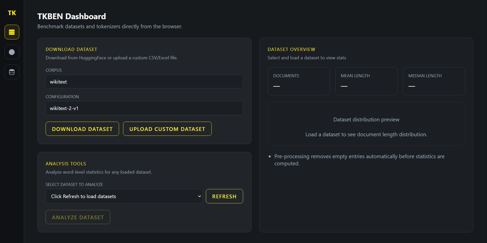
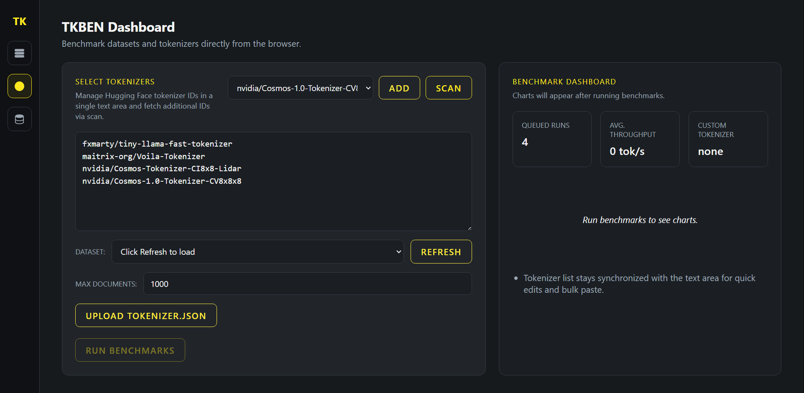

# TKBEN-tokenizers-benchmarker: Exploring and Benchmarking Open Source Tokenizers

## 1. Introduction
Tokenizers are essential components in text preprocessing, converting raw text into structured data understandable by NLP models. The choice of tokenizer directly influences model performance, making it a critical decision in building effective language-based applications.

**TKBEN** is a comprehensive **Web Application** designed to simplify tokenizer analysis and comparison. Built with a robust Python backend and a modern React-based frontend, it allows users to effortlessly download HuggingFace's open-source tokenizers and public text datasets to conduct detailed benchmarks. TKBEN enables exploration of tokenizer attributes including speed, granularity, special character handling, and language support.

With TKBEN, users can effectively evaluate tokenizer performance in various NLP tasks, ensuring informed decisions and optimized model performance.

## 2. Installation
The installation process for Windows is fully automated. Simply run the script `start_on_windows.bat` to begin.
This script sets up a portable environment (Python + Node.js), installs all dependencies, and launches both the backend server and the web interface.

## 3. How to use
Run `start_on_windows.bat` to launch the application.
The web interface will automatically open in your default browser at `http://127.0.0.1:7861`.

*Note: Some antivirus software may flag the portable python environment. If you encounter issues, consider adding an exception.*

### Main Interface
The intuitive web interface allows you to:
- **Manage Datasets**: Load, analyze, and visualize text datasets.
- **Select Tokenizers**: Search and download tokenizers directly from HuggingFace.
- **Run Benchmarks**: Compare multiple tokenizers simultaneously across different metrics.

### Benchmark Results
Benchmark results are visualized with interactive charts and stored in the application's database.

**Local per-text statistics include**:
- **Text characters**: Number of characters in the original text.
- **Words count**: Number of words in the text.
- **AVG words length**: Average character length of words.
- **Tokens count**: Total number of tokens generated.
- **Avg tokens length**: Average character length of tokens.
- **Tokens/Words ratio**: Ratio of tokens to words (fertility).

**Global per-tokenizer metrics include**:
- **Tokenization Speed**: Tokens processed per second.
- **Throughput**: Raw characters processed per second.
- **Vocabulary Size**: Total unique tokens.
- **Subword Fertility**: Average tokens per word.
- **OOV Rate**: Percentage of out-of-vocabulary words.

## 4. Setup and Configuration
You can run `setup_and_maintenance.bat` for maintenance tasks:
- **Update project**: Pull latest changes from GitHub.
- **Remove logs**: Clean up log files.

### 4.1 Resources
- **Database**: Results and datasets are stored in `TKBEN/resources/database/tkben_database.db` (SQLite).
- **Settings**: Configuration files are in `settings/`.
- **Environmental Variables**: Create a `.env` file in `settings/.env` if you need to override defaults (e.g., `FASTAPI_PORT`, `UI_PORT`).

| Variable              | Description                                              |
|-----------------------|----------------------------------------------------------|
| ACCESS_TOKEN          | HuggingFace access token (required for some tokenizers)  |
| TF_CPP_MIN_LOG_LEVEL  | TensorFlow logging verbosity                             |
| MPLBACKEND            | Matplotlib backend, keep default as Agg                  |

## 5. License
This project is licensed under the terms of the MIT license. See the LICENSE file for details.

