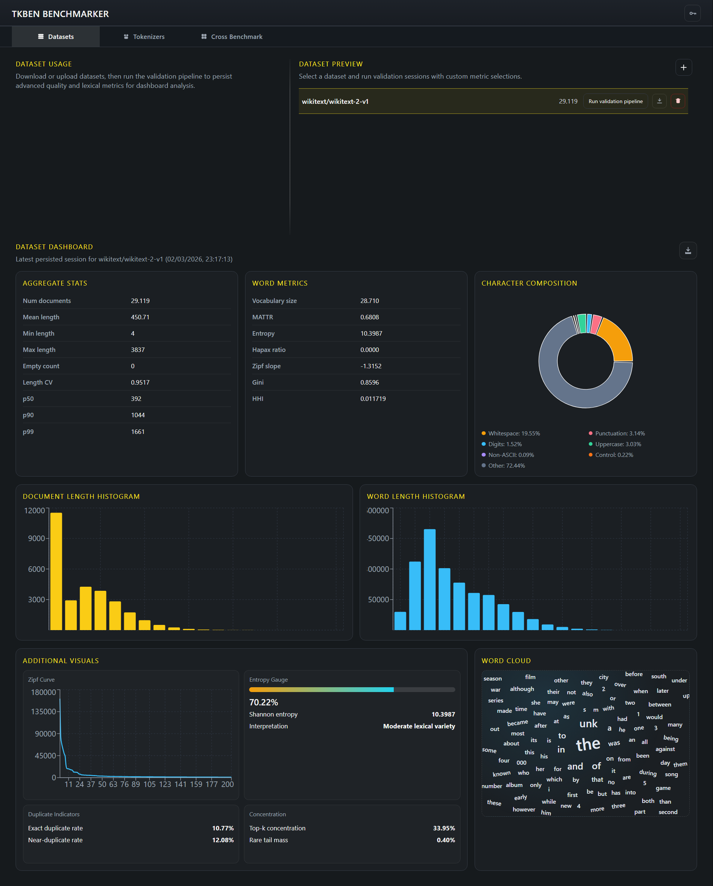
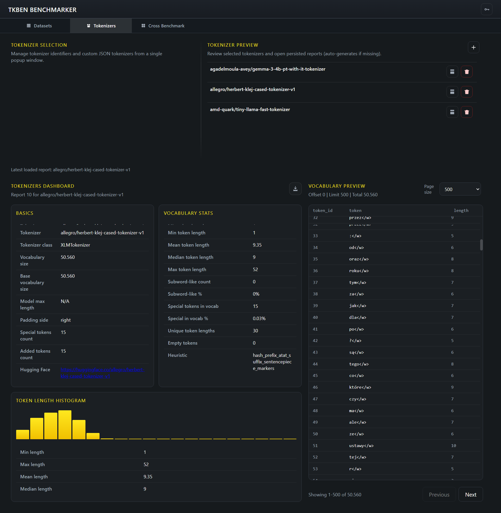
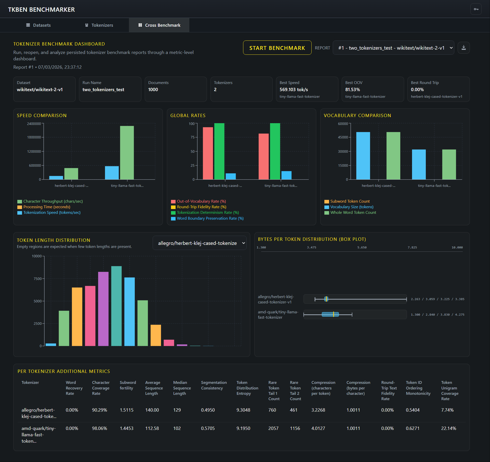

# TKBEN Tokenizer Benchmarker

## 1. Project Overview
TKBEN is a local web application for downloading/uploading text datasets, managing tokenizer assets, and benchmarking tokenizer behavior on real corpora.

The system is split into a Python/FastAPI backend and a React frontend. The backend downloads tokenizers and datasets, runs benchmarks, and stores results in a local database. The frontend provides the UI for managing datasets, running benchmarks, and visualizing results.

> **Work in Progress**: This project is still under active development. It will be updated regularly, but you may encounter bugs, issues, or incomplete features.

## 2. Installation

### 2.1 Windows (One-Click Setup)
Run:

```bat
TKBEN\start_on_windows.bat
```

The launcher:
1. Downloads portable Python, uv, and Node.js into `TKBEN/resources/runtimes`.
2. Installs backend dependencies from `pyproject.toml` using `uv`.
3. Installs/builds frontend dependencies when needed.
4. Starts backend and frontend servers and opens the UI in your browser.

First run performs runtime/bootstrap downloads. Subsequent runs reuse local artifacts when available.

### 2.2 macOS / Linux (Manual Setup)
Prerequisites:
- Python 3.14+
- Node.js 22+
- `uv`

Backend:

```bash
uv sync
uv run python -m uvicorn TKBEN.server.app:app --host 127.0.0.1 --port 8000
```

Frontend (new terminal):

```bash
cd TKBEN/client
npm install
npm run dev -- --host 127.0.0.1 --port 5173 --strictPort
```

## 3. How to Use

### 3.1 Windows
Run `TKBEN/start_on_windows.bat`.
- UI: `http://127.0.0.1:5173`
- API: `http://127.0.0.1:8000`
- API docs: `http://127.0.0.1:8000/docs`

### 3.2 macOS / Linux
After starting backend/frontend manually:
- UI: `http://127.0.0.1:5173`
- API: `http://127.0.0.1:8000`
- API docs: `http://127.0.0.1:8000/docs`

### 3.3 Typical Workflow
Use the app left-to-right as a pipeline: prepare data, inspect tokenizer behavior, then run cross-tokenizer benchmarks.

1. Open **Datasets** (`/dataset`)
- Add data from Hugging Face (preset or manual dataset/config) or upload local CSV/XLS/XLSX files.
- Select a persisted dataset from the preview list to make it the active working dataset.
- Run the validation/analysis workflow with metric categories, sampling, and optional filters.
- Reopen the latest persisted dataset report to inspect corpus statistics and charts.



2. Open **Tokenizers** (`/tokenizers`)
- Scan Hugging Face tokenizer IDs (HF access key required), then download selected tokenizers locally.
- Optionally upload a custom `tokenizer.json` for compatibility checks.
- Open or generate tokenizer reports and inspect vocabulary statistics, histograms, and paged token tables.
- Use this page to decide which tokenizers should move to benchmark runs.



3. Open **Cross Benchmark** (`/cross-benchmark`)
- Start the benchmark wizard and choose run name, dataset, tokenizers, and metric set.
- Run benchmark jobs and reopen persisted reports from the report selector.
- Compare tokenizer performance across throughput, vocabulary behavior, quality rates, and distribution metrics.
- Use the per-tokenizer drilldowns to identify tradeoffs before final selection.



## 4. Setup and Maintenance
Run:

```bat
TKBEN\setup_and_maintenance.bat
```

Menu actions:
- Remove logs: deletes `*.log` files under `TKBEN/resources/logs`.
- Uninstall app: removes local runtime/dependency/build artifacts (portable runtimes, `.venv`, frontend `node_modules`, `dist`, lock artifacts).
- Initialize database: executes `TKBEN/scripts/initialize_database.py`.

## 5. Resources
- `TKBEN/resources/database.db`: default embedded SQLite database file.
- `TKBEN/resources/sources/datasets`: Hugging Face/download cache and dataset source artifacts.
- `TKBEN/resources/sources/tokenizers`: cached tokenizer files used for local loading.
- `TKBEN/resources/logs`: launcher/backend logs.
- `TKBEN/resources/runtimes`: portable Windows runtimes (Python, uv, Node.js).
- `TKBEN/resources/templates`: reserved template assets.

## 6. Configuration
Backend configuration is defined in `TKBEN/settings/configurations.json` and can be overridden via environment variables in `TKBEN/settings/.env` (loaded on startup).
Frontend hosting (host/port) is controlled by the Windows launcher and Vite using the same `TKBEN/settings/.env` file; there is no separate frontend configuration file.


## 8. License
This project is licensed under the MIT License. See `LICENSE` for details.
