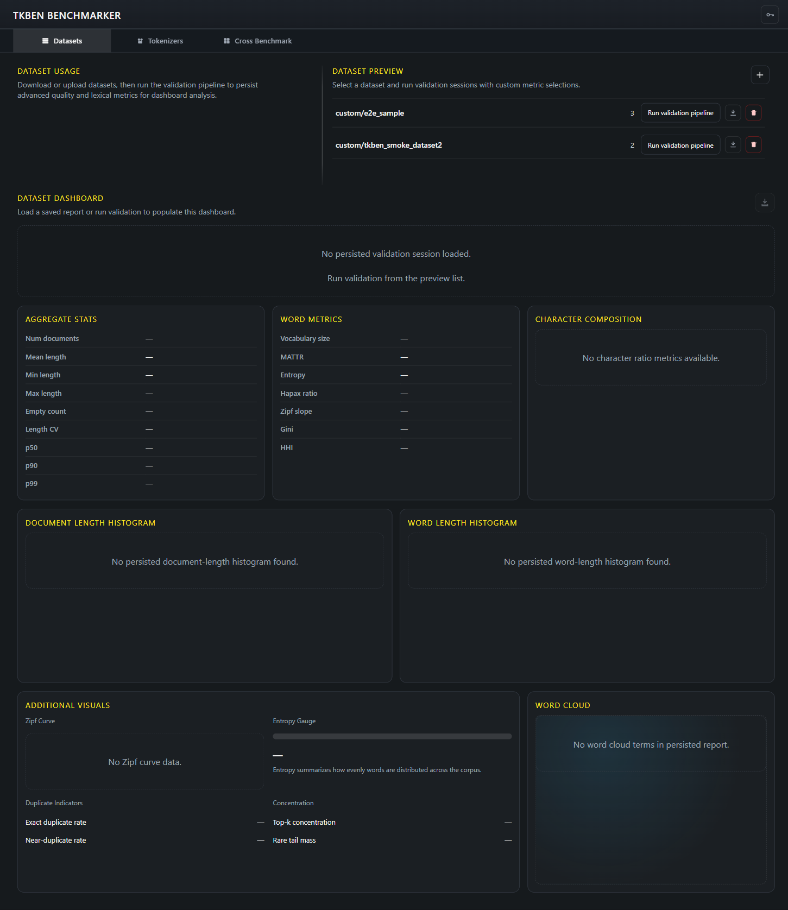
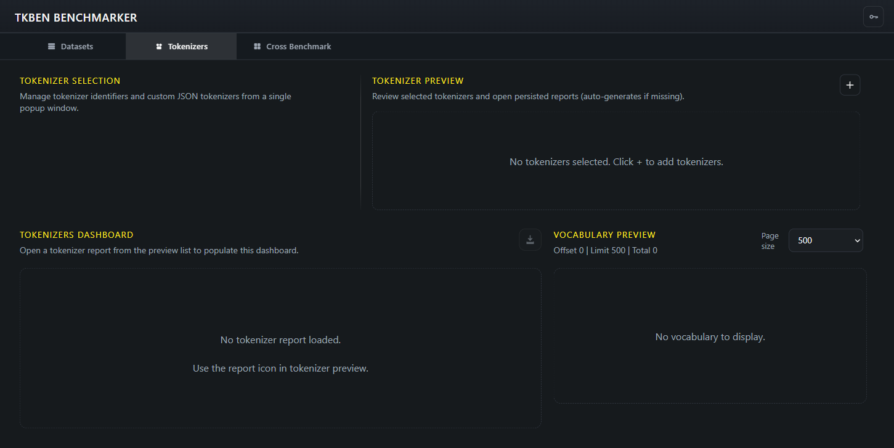
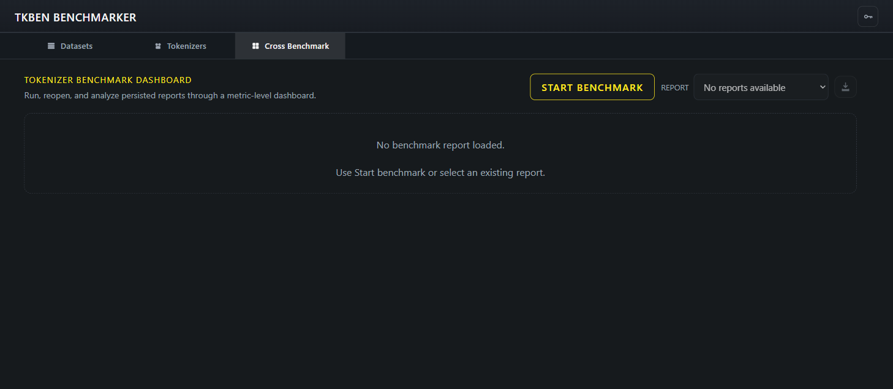

# TKBEN Tokenizer Benchmarker
[](https://github.com/CTCycle/TKBEN-tokenizers-benchmarker/releases)


[](LICENSE)
[](https://github.com/CTCycle/TKBEN-tokenizers-benchmarker/actions/workflows/ci.yml)

## 1. Project Overview

TKBEN is a tokenizer benchmarking platform for text datasets and tokenizer assets.

Main workflow routes:
- `/dataset`
- `/tokenizers`
- `/cross-benchmark`

Runtime model:
- **Local webapp mode (default)**: run directly on host via `start_on_windows.bat`.
- **Packaged desktop mode**: build and run the local Tauri package.
- **Single runtime env file**: edit `settings/.env` (seed from `settings/.env.example`).

Default embedded storage is the SQLite file at `app/resources/database.db`.

## 2. Installation

### 2.1 Windows (One-Click Local Setup)

Run the launcher from repository root:

```bat
.\start_on_windows.bat
```

The launcher will:
1. Install portable Python, `uv`, and Node.js under `runtimes`.
2. Install backend dependencies using `uv sync`.
3. Install frontend dependencies (`npm ci` when lockfile is present, fallback to `npm install`).
4. Build and start backend + frontend.

### 2.2 Windows Packaged Desktop (Tauri)

Prerequisites:
- Rust toolchain (`cargo`) with a default toolchain configured.

```bat
copy /Y settings\.env.example settings\.env
.\release\tauri\build_with_tauri.bat
```

### 2.3 macOS / Linux (Manual Local Setup)

**Prerequisites**:
- Python 3.14+
- Node.js 22+
- `uv`

**Setup Steps**:
1. Install backend dependencies
   ```bash
   uv sync
   ```
2. Start backend
   ```bash
   uv run python -m uvicorn server.app:app --host 127.0.0.1 --port 5000
   ```
3. Start frontend (new terminal)
   ```bash
   cd app/client
   npm ci
   npm run preview -- --host 127.0.0.1 --port 8000 --strictPort
   ```

## 3. How to Use

### 3.1 Runtime Configuration (`.env`)

Use `settings/.env` as the active runtime file for both local webapp mode and packaged desktop mode.

Initialize from the single template:
```bat
copy /Y settings\.env.example settings\.env
```

### 3.2 Local Webapp Mode (Default)

```bat
.\start_on_windows.bat
```

Runtime addresses are taken from `settings/.env`:
- **Web UI**: `http://<UI_HOST>:<UI_PORT>`
- **Backend API**: `http://<FASTAPI_HOST>:<FASTAPI_PORT>`
- **API Docs**: `http://<FASTAPI_HOST>:<FASTAPI_PORT>/docs`

### 3.3 Packaged Desktop Mode (Tauri)

```bat
copy /Y settings\.env.example settings\.env
.\release\tauri\build_with_tauri.bat
```

Build artifacts are produced under:
- `release/windows/installers`
- `release/windows/portable`

### 3.4 Application Flow

**Dataset (`/dataset`)**

Load data from Hugging Face presets or manual IDs, or upload local CSV/XLS/XLSX files. Then run dataset analysis and reopen saved reports for statistics and charts.

**Tokenizers (`/tokenizers`)**

Scan available tokenizer IDs, download selected tokenizers, optionally upload a custom `tokenizer.json`, and inspect tokenizer reports.

**Cross Benchmark (`/cross-benchmark`)**

Create benchmark runs by selecting dataset, tokenizers, and metric categories, then compare persisted results across tokenizer candidates.
### 3.5 Product Snapshots (Release 3.3.0)

The following snapshots were captured in local webapp mode with backend and frontend running:

- Dataset workspace showing available datasets, validation actions, and dashboard metric placeholders before loading a persisted report.


- Tokenizers workspace showing selection controls, preview panel, and empty dashboard state before report loading.


- Cross-benchmark workspace showing benchmark start controls and report selector in initial state.


## 4. Setup and Maintenance

Run:

```bat
.\setup_and_maintenance.bat
```

Available actions:
- **Remove logs**: Deletes `*.log` files under `app/resources/logs`.
- **Uninstall app**: Removes local runtime artifacts under `runtimes\` (including `app\\server\\.venv` and `app\\server\\uv.lock`), frontend `node_modules`, frontend `dist`, and related local artifacts.
- **Initialize database**: Executes `app/scripts/initialize_database.py` using local `uv` + portable Python runtime.

## 5. Resources

Key paths:
- `app/resources/database.db`: Embedded SQLite database path.
- `app/resources/sources/datasets`: Dataset source/download artifacts.
- `app/resources/sources/tokenizers`: Tokenizer source/download artifacts.
- `app/resources/logs`: Launcher and backend logs.
- `runtimes`: Portable Windows runtimes.
- `assets/docs/RUNTIME_MODES.md`: Runtime packaging and mode details.
- `assets/docs/USER_MANUAL.md`: End-user journeys, commands, and feature usage.

## 6. Configuration

Configuration is split between:
- `settings/.env`: Active runtime/process configuration used by launcher, tests, frontend dev/preview, and desktop startup.
- `settings/.env.example`: Single template for `.env`.
- `settings/configurations.json`: Backend structured settings, including all database mode/connection/tuning values.

Core runtime keys you will commonly edit:
- `FASTAPI_HOST`, `FASTAPI_PORT`
- `UI_HOST`, `UI_PORT`
- `VITE_API_BASE_URL` (normally `/api`)
- `RELOAD`
- `HF_KEYS_ENCRYPTION_KEY`

Determinism:
- Backend lockfile: `app/server/uv.lock` (generated/updated directly by running `uv sync` from `app/server`).
- Frontend lockfile: committed `app/client/package-lock.json` + `npm ci` in local runtime/bootstrap flow.

## 7. License

This project is licensed under the MIT License. See `LICENSE` for details.


