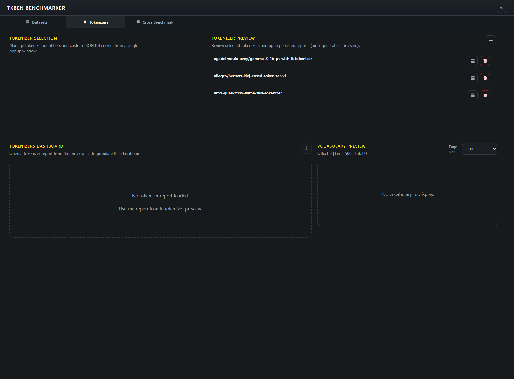
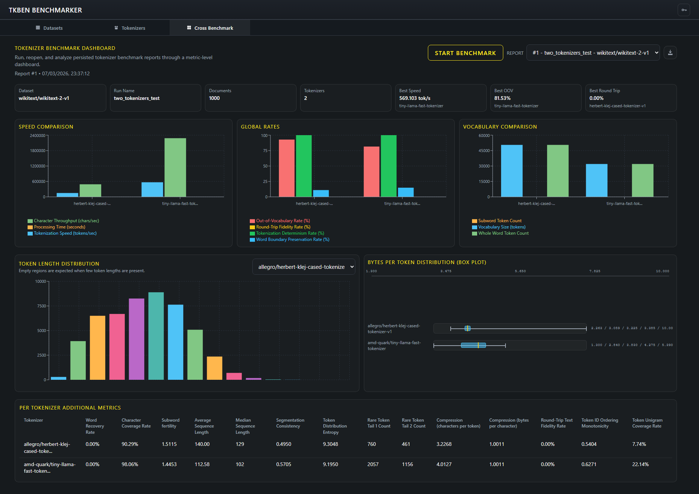
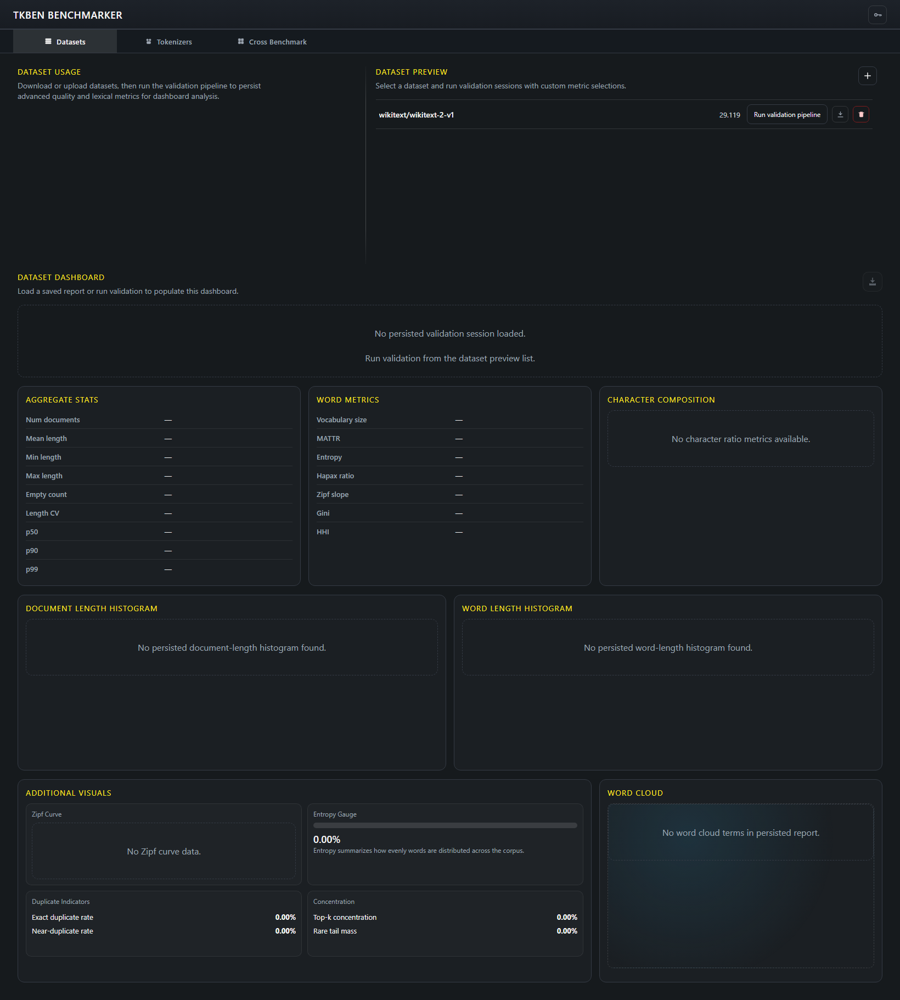
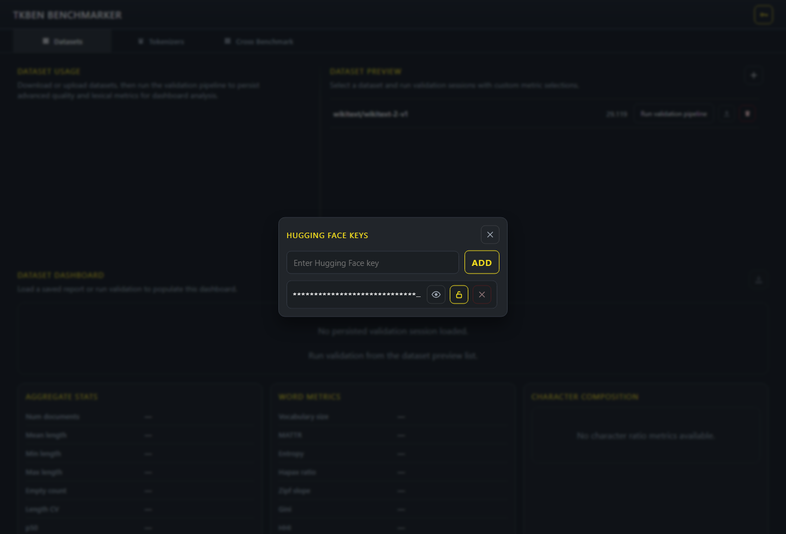

# TKBEN Tokenizer Benchmarker

## 1. Project Overview

TKBEN is a tokenizer benchmarking platform for text datasets and tokenizer assets.

The application is organized as:
- **Backend**: FastAPI services for data ingestion, tokenizer operations, benchmark jobs, and persisted reports.
- **Frontend**: React-based UI for dataset management, tokenizer analysis, and cross-benchmark reporting.

Main workflow routes:
- `/dataset`
- `/tokenizers`
- `/cross-benchmark`

Runtime model:
- **Local webapp mode (default)**: run directly on host via `TKBEN/start_on_windows.bat`.
- **Packaged desktop mode**: build and run the local Tauri package.
- **Mode switch**: replace values in `TKBEN/settings/.env` using local profile templates.

Default embedded storage is the SQLite file at `TKBEN/resources/database.db`.

## 2. Installation

### 2.1 Windows (One-Click Local Setup)

Run the launcher from repository root:

```bat
.\TKBEN\start_on_windows.bat
```

The launcher will:
1. Install portable Python, `uv`, and Node.js under `runtimes`.
2. Install backend dependencies using `uv sync`.
3. Install frontend dependencies (`npm ci` when lockfile is present, fallback to `npm install`).
4. Build and start backend + frontend.

### 2.2 Windows Packaged Desktop (Tauri)

Prerequisites:
- Rust toolchain (`cargo`) with a default toolchain configured.

```bat
copy /Y TKBEN\settings\.env.local.tauri.example TKBEN\settings\.env
.\release\tauri\build_with_tauri.bat
```

### 2.3 macOS / Linux (Manual Local Setup)

**Prerequisites**:
- Python 3.14+
- Node.js 22+
- `uv`

**Setup Steps**:
1. Install backend dependencies
   ```bash
   uv sync
   ```
2. Start backend
   ```bash
   uv run python -m uvicorn TKBEN.server.app:app --host 127.0.0.1 --port 5000
   ```
3. Start frontend (new terminal)
   ```bash
   cd TKBEN/client
   npm ci
   npm run preview -- --host 127.0.0.1 --port 8000 --strictPort
   ```

## 3. How to Use

### 3.1 Mode Switching (`.env` Profiles)

Use `TKBEN/settings/.env` as the active runtime file.

Local webapp profile:
```bat
copy /Y TKBEN\settings\.env.local.example TKBEN\settings\.env
```

Local packaged desktop profile (Tauri):
```bat
copy /Y TKBEN\settings\.env.local.tauri.example TKBEN\settings\.env
```

### 3.2 Local Webapp Mode (Default)

```bat
.\TKBEN\start_on_windows.bat
```

Runtime addresses are taken from `TKBEN/settings/.env`:
- **Web UI**: `http://<UI_HOST>:<UI_PORT>`
- **Backend API**: `http://<FASTAPI_HOST>:<FASTAPI_PORT>`
- **API Docs**: `http://<FASTAPI_HOST>:<FASTAPI_PORT>/docs`

### 3.3 Packaged Desktop Mode (Tauri)

```bat
copy /Y TKBEN\settings\.env.local.tauri.example TKBEN\settings\.env
.\release\tauri\build_with_tauri.bat
```

Build artifacts are produced under:
- `release/windows/installers`
- `release/windows/portable`

### 3.4 Application Flow

**Dataset (`/dataset`)**

Load data from Hugging Face presets or manual IDs, or upload local CSV/XLS/XLSX files. Then run dataset analysis and reopen saved reports for statistics and charts.


**Tokenizers (`/tokenizers`)**

Scan available tokenizer IDs, download selected tokenizers, optionally upload a custom `tokenizer.json`, and inspect tokenizer reports.



**Cross Benchmark (`/cross-benchmark`)**

Create benchmark runs by selecting dataset, tokenizers, and metric categories, then compare persisted results across tokenizer candidates.



### 3.5 Screenshots

#### Home



#### Dataset


#### Tokenizers


#### Cross Benchmark


#### Settings



## 4. Setup and Maintenance

Run:

```bat
.\TKBEN\setup_and_maintenance.bat
```

Available actions:
- **Remove logs**: Deletes `*.log` files under `TKBEN/resources/logs`.
- **Uninstall app**: Removes local runtime artifacts under `runtimes\` (including `runtimes\.venv` and `runtimes\uv.lock`), frontend `node_modules`, frontend `dist`, and related local artifacts.
- **Initialize database**: Executes `TKBEN/scripts/initialize_database.py` using local `uv` + portable Python runtime.

## 5. Resources

Key paths:
- `TKBEN/resources/database.db`: Embedded SQLite database path.
- `TKBEN/resources/sources/datasets`: Dataset source/download artifacts.
- `TKBEN/resources/sources/tokenizers`: Tokenizer source/download artifacts.
- `TKBEN/resources/logs`: Launcher and backend logs.
- `runtimes`: Portable Windows runtimes.
- `assets/docs/PACKAGING_AND_RUNTIME_MODES.md`: Runtime packaging and mode details.

## 6. Configuration

Configuration is split between:
- `TKBEN/settings/.env`: Active runtime profile used by launcher, local runs, and desktop packaging.
- `TKBEN/settings/.env.local.example`: Reference local profile.
- `TKBEN/settings/.env.local.tauri.example`: Reference Tauri-local profile.
- `TKBEN/settings/configurations.json`: Backend operational defaults.

Core runtime keys:

| Key | Purpose |
|---|---|
| `FASTAPI_HOST`, `FASTAPI_PORT` | Backend bind host/port. |
| `UI_HOST`, `UI_PORT` | Frontend host/port for local webapp and packaged desktop runtime. |
| `VITE_API_BASE_URL` | Frontend API base path (`/api`). |
| `RELOAD` | Backend live reload toggle for local development. |
| `DB_EMBEDDED` | Runtime DB mode switch (`true` = SQLite, `false` = external DB). |
| `DB_ENGINE`, `DB_HOST`, `DB_PORT`, `DB_NAME`, `DB_USER`, `DB_PASSWORD` | External DB connection fields. |
| `DB_SSL`, `DB_SSL_CA` | External DB TLS settings. |
| `DB_CONNECT_TIMEOUT`, `DB_INSERT_BATCH_SIZE` | DB connection/write tuning. |
| `OPTIONAL_DEPENDENCIES` | Optional test dependency installation toggle in local launcher flow. |
| `MPLBACKEND`, `KERAS_BACKEND` | Runtime backend settings for plotting/ML stack. |
| `HF_KEYS_ENCRYPTION_KEY` | Required key-management encryption secret. |

Determinism:
- Backend lockfile: `runtimes/uv.lock` (copied to root `uv.lock` before `uv sync --frozen`, then copied back).
- Frontend lockfile: committed `TKBEN/client/package-lock.json` + `npm ci` in local runtime/bootstrap flow.

## 7. License

This project is licensed under the MIT License. See `LICENSE` for details.

