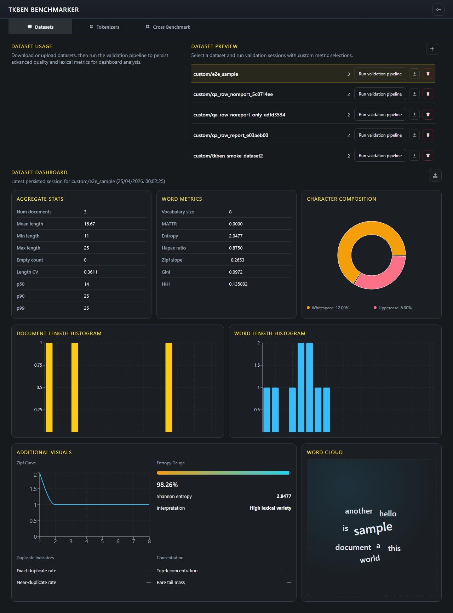
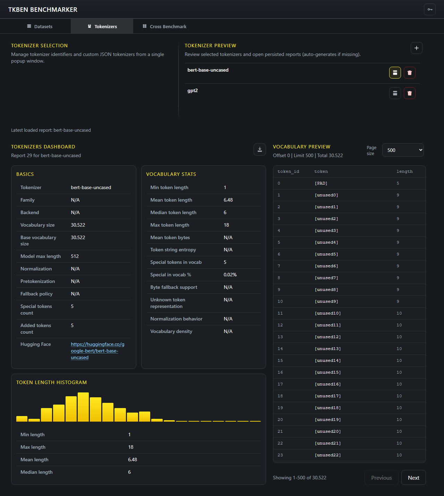
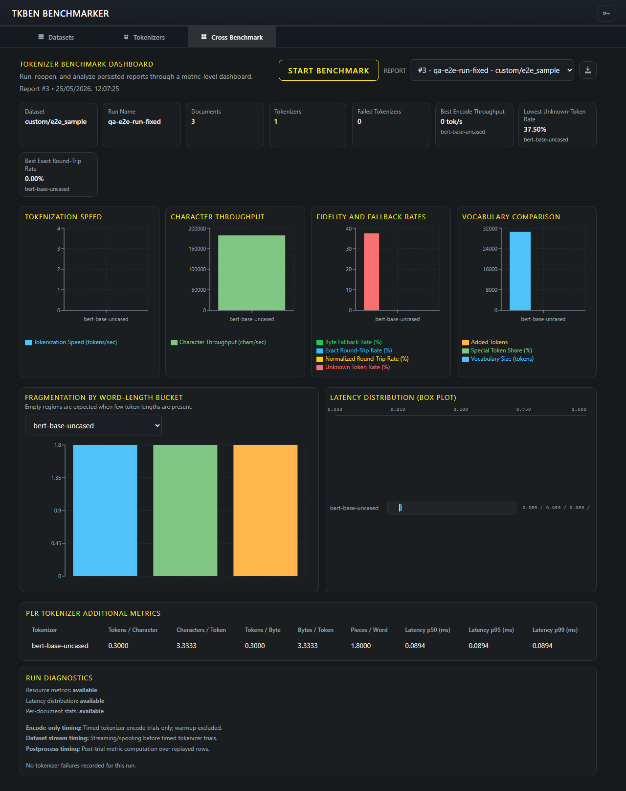

# TKBEN Tokenizer Benchmarker
[](https://github.com/CTCycle/TKBEN-tokenizers-benchmarker/releases)


[](LICENSE)
[](https://ctcycle.github.io/CTCycle/)
[](https://github.com/CTCycle/TKBEN-tokenizers-benchmarker/actions/workflows/ci.yml?query=branch%3Adevelop)

## 1. Project Overview

TKBEN is a tokenizer benchmarking platform for text datasets and tokenizer assets.

Main workflow routes:
- `/dataset`
- `/tokenizers`
- `/cross-benchmark`

Runtime model:
- **Local webapp mode (default)**: run directly on host via `start_on_windows.ps1`.
- **Single runtime env file**: launcher-managed runs use `settings/.env`, seeded from `settings/.env.example`.

Launcher-managed runs use `settings/.env` and repository resource paths; direct/manual development and tests use the same local configuration model.

## 2. Installation

### 2.1 Windows (One-Click Local Setup)

Run the single developer and maintenance entry point from any directory:

```powershell
.\start_on_windows.ps1
```

`start_on_windows.ps1` is the sole root launcher and opens the combined eight-option menu. Choose **Launch application** to download pinned portable Python, uv, and Node.js runtimes when missing, synchronize dependencies, build the frontend, and start FastAPI plus the Vite preview server.

### 2.2 macOS / Linux (Manual Local Setup)

**Prerequisites**:
- Python 3.14+
- Node.js 22+
- `uv`

**Setup Steps**:
1. Install backend dependencies
   ```bash
   uv sync
   ```
2. Start backend
   ```bash
   uv run python -m uvicorn server.app:app --host 127.0.0.1 --port 5000
   ```
3. Start frontend (new terminal)
   ```bash
   cd app/client
   npm ci
   npm run preview -- --host 127.0.0.1 --port 8000 --strictPort
   ```

## 3. How to Use

### 3.1 Runtime Configuration (`.env`)

The launcher creates `settings/.env` from `settings/.env.example` on first use. `settings/.env` is local and ignored; `settings/.env.example` and `settings/configurations.json` remain versioned templates.

Initialize from the single template:
```bat
Copy-Item settings\.env.example "$env:LOCALAPPDATA\TKBEN\config\.env"
```

### 3.2 Local Webapp Mode (Default)

```powershell
.\start_on_windows.ps1
```

Runtime addresses are taken from the user configuration:
- **Web UI**: `http://<UI_HOST>:<UI_PORT>`
- **Backend API**: `http://<FASTAPI_HOST>:<FASTAPI_PORT>`
- **API Docs**: `http://<FASTAPI_HOST>:<FASTAPI_PORT>/docs`

### 3.3 Application Flow

**Dataset (`/dataset`)**

Load data from Hugging Face presets or manual IDs, or upload local CSV/XLS/XLSX files. Then run dataset analysis and reopen saved reports for statistics and charts.

**Tokenizers (`/tokenizers`)**

Scan available tokenizer IDs, download selected tokenizers, optionally upload a custom `tokenizer.json`, and inspect tokenizer reports.

**Cross Benchmark (`/cross-benchmark`)**

Create benchmark runs by selecting dataset, tokenizers, and metric categories, then compare persisted results across tokenizer candidates.
### 3.4 Product Snapshots

The following snapshots were captured in local webapp mode with backend and frontend running:

- Dataset dashboard with a loaded persisted validation session, aggregate statistics, histograms, and word-cloud analytics.


- Tokenizers dashboard with an opened tokenizer report, vocabulary statistics, and populated token preview table.


- Cross-benchmark dashboard with a loaded run summary and comparative metric panels.


## 4. Setup and Maintenance

Run the unified menu:

```powershell
.\start_on_windows.ps1
```

The menu contains launch, dependency installation/update, database initialization, test execution, log removal, cache cleanup, uninstall, and exit actions. Launching starts the backend and frontend, opens the browser, prints the active ports and process IDs, and then exits the menu.

## 5. Resources

Key paths:
- `app/resources`: SQLite database, downloaded sources, logs, and mutable application data.
- `settings`: Local `.env` plus versioned structured configuration and environment templates.
- `runtimes`: Portable Windows runtimes.
- `assets/docs/project_index.md`: Documentation root index and topic map.
- `assets/docs/runtime/modes.md`: Supported runtime mode details.
- `assets/docs/runtime/startup.md`: Startup procedures and launcher commands.

## 6. Configuration

Configuration is split between:
- `settings/.env.example`: Versioned configuration template; `settings/.env` must never be committed.
- `settings/configurations.json`: Backend structured settings for datasets, tokenizers, benchmarks, jobs, and optional database overrides.

Core runtime keys you will commonly edit:
- `FASTAPI_HOST`, `FASTAPI_PORT`
- `UI_HOST`, `UI_PORT`
- `VITE_API_BASE_URL` (normally `/api`)
- `RELOAD`
- `DATABASE_EMBEDDED`
- `DATABASE_URL`
- `DATABASE_HOST`, `DATABASE_PORT`
- `DATABASE_NAME`
- `DATABASE_USERNAME`, `DATABASE_PASSWORD`
- `HF_KEYS_ENCRYPTION_KEY`

Determinism:
- Backend lockfile: `app/server/uv.lock` (generated/updated directly by running `uv sync` from `app/server`).
- Frontend lockfile: committed `app/client/package-lock.json` + `npm ci`.

## 7. Releases and Repository Hygiene

Continuous integration validates the locked backend and frontend sources. Keep `app/server/uv.lock` and `app/client/package-lock.json` tracked so installations remain reproducible.

GitHub releases provide a versioned repository source ZIP for download. The archive contains tracked source files only; local environments, credentials, dependencies, caches, logs, and generated build output are excluded.

Never commit `.env` files, credentials, databases, downloaded model/data caches, logs, virtual environments, Node dependencies, or generated frontend output. Keep configuration templates, scripts, workflows, migrations, and both application lockfiles tracked.

## 8. License

This project is licensed under the MIT License. See `LICENSE` for details.


