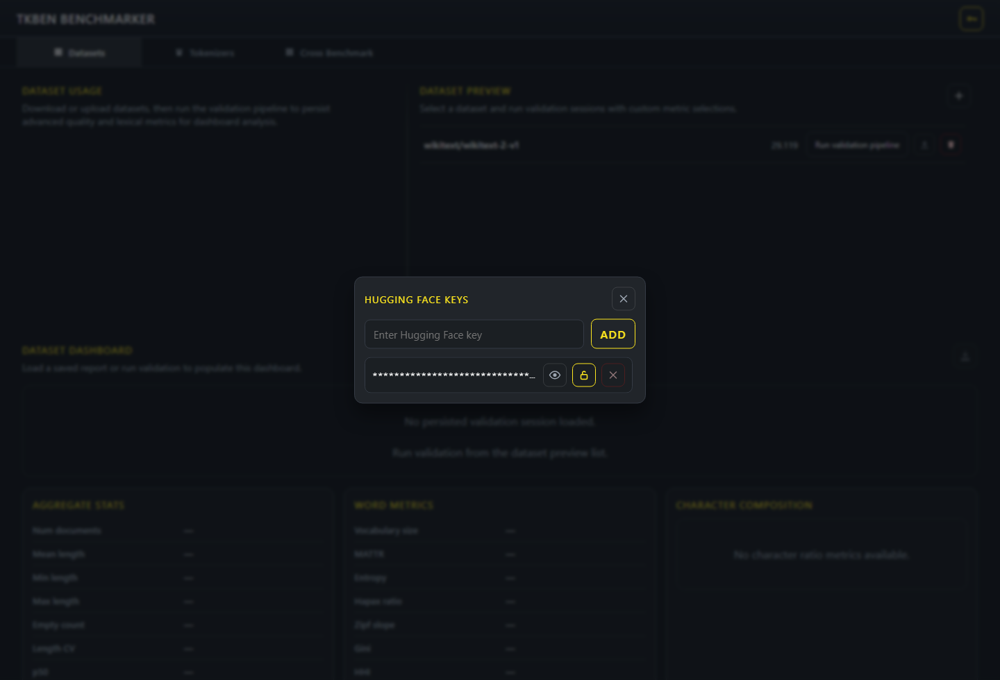
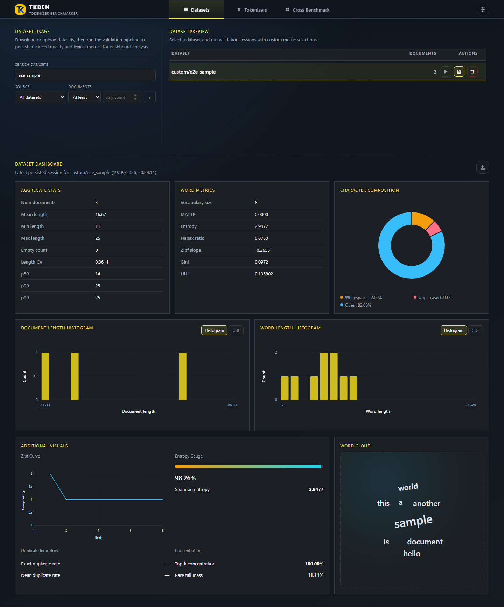
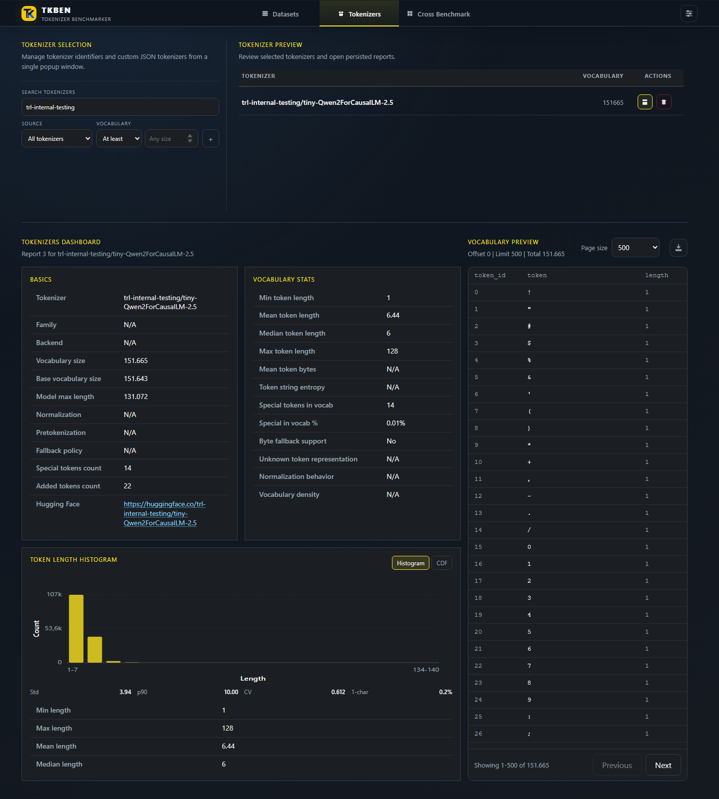
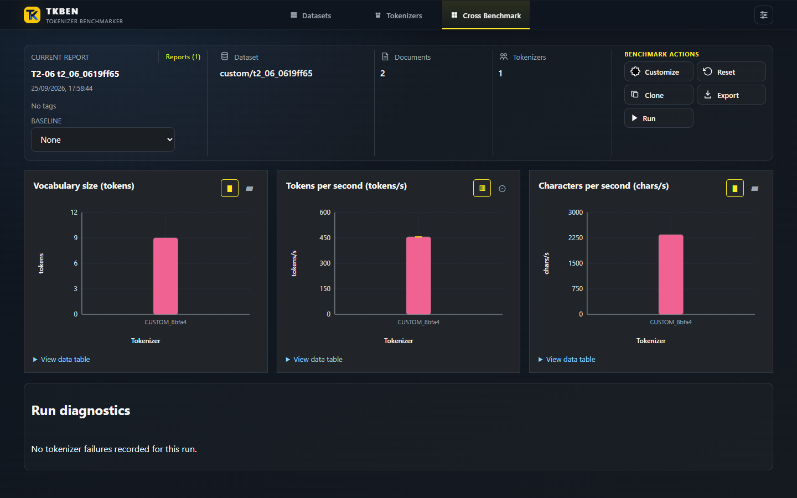

# TKBEN Tokenizer Benchmarker
Last updated: 2026-08-18
[](https://github.com/CTCycle/TKBEN-tokenizers-benchmarker/releases)


[](LICENSE)
[](https://ctcycle.github.io/CTCycle/)
[](https://github.com/CTCycle/TKBEN-tokenizers-benchmarker/actions/workflows/ci.yml?query=branch%3Adevelop)

## 1. Project Overview

TKBEN is a local web application for examining tokenizer assets, validating text datasets, and comparing tokenizer performance across repeatable benchmark runs. It keeps downloaded assets, validation reports, and benchmark results in the application workspace so that a later session can reopen and inspect the same evidence. The browser is the user interface, while a local FastAPI service performs processing and stores the resulting reports.

The main workflows are:

- **Dataset validation**: load a Hugging Face dataset, a custom dataset identifier, or a local CSV/XLS/XLSX file; select validation metrics; and review persisted statistics, lexical indicators, histograms, and charts.
- **Tokenizer examination**: scan or add tokenizer identifiers, download supported assets, upload a custom `tokenizer.json`, and inspect vocabulary and token-length reports.
- **Cross-benchmark comparison**: select a saved dataset and tokenizer set, run benchmark metrics, reorder or customize dashboard widgets, and export the resulting comparison as a PDF.

Main workflow routes:
- `/dataset`
- `/tokenizers`
- `/cross-benchmark`

Runtime model:
- **Local webapp mode (default)**: run directly on host via `start_on_windows.ps1`.
- **Single runtime env file**: launcher-managed runs use `settings/.env`, seeded from `settings/.env.example`.

Launcher-managed runs use `settings/.env` and repository resource paths; direct/manual development and tests use the same local configuration model.

The normal workflow is sequential but flexible: validate at least one dataset, prepare one or more tokenizers, run a benchmark, and then compare or export the saved results. Each page can reopen persisted reports, so a completed validation or benchmark does not need to be repeated just to inspect it later.

## 2. Installation

### 2.1 Windows (One-Click Local Setup)

From the repository root, run the single application and maintenance entry point:

```powershell
.\start_on_windows.ps1
```

`start_on_windows.ps1` opens the combined eight-option menu. Choose **Launch application** to download pinned portable Python, uv, and Node.js runtimes when missing, synchronize Python dependencies, reuse unchanged frontend dependencies, build the Angular frontend when enabled, and start FastAPI plus the Angular production preview server. The launcher also waits for the backend health endpoint and frontend before reporting success. The dependency maintenance option offers a **Development** profile with Ruff, BasedPyright, and pytest extras, or a **Standard** profile with runtime dependencies only.

On the first launch, allow dependency setup to finish and note the URL printed by the launcher. Subsequent launches can reuse the local runtimes and unchanged frontend dependencies. Use the maintenance menu when you need to install or update dependencies, initialize the database, run tests, clean logs or caches, or uninstall the managed runtime.

### 2.2 macOS / Linux (Manual Local Setup)

**Prerequisites**:
- Python 3.14+
- Node.js 22+
- `uv`

**Setup Steps**:
1. Install backend dependencies
   ```bash
   cd app/server
   uv sync
   ```
2. Start backend
   ```bash
   uv run python -m uvicorn server.app:app --app-dir .. --host 127.0.0.1 --port 5000
   ```
3. Start frontend (new terminal)
   ```bash
   cd app/client
   npm ci
   npm run preview -- --host 127.0.0.1 --port 8000 --strictPort
   ```

## 3. How to Use

### 3.1 Runtime Configuration (`.env`)

The launcher creates `settings/.env` from `settings/.env.example` on first use. `settings/.env` is local and ignored; `settings/.env.example` and `settings/configurations.json` remain versioned templates.

Initialize from the single template:
```powershell
Copy-Item settings\.env.example settings\.env
```

Most users can keep the generated defaults. Open `settings/.env` when you need to change local hosts or ports, choose whether the frontend is rebuilt at startup, set `TKBEN_DATA_DIR` to relocate the resource root (including the embedded SQLite database), or configure optional Hugging Face and database integration. Keep secrets and machine-specific values in this ignored file.

### 3.2 Local Webapp Mode (Default)

```powershell
.\start_on_windows.ps1
```

Runtime addresses are taken from the user configuration:
- **Web UI**: `http://<UI_HOST>:<UI_PORT>`
- **Backend API**: `http://<FASTAPI_HOST>:<FASTAPI_PORT>`
- **API Docs**: `http://<FASTAPI_HOST>:<FASTAPI_PORT>/docs`

### 3.3 Application Flow

**Dataset (`/dataset`)**

Load data from a Hugging Face preset or manual ID, or upload a local CSV/XLS/XLSX file. Select a dataset row to preview its document count, run the validation pipeline, and reopen the latest saved report for aggregate statistics, lexical metrics, histograms, and additional visual analysis.

Use the catalog filters to narrow the available entries before selecting a dataset. Start validation after confirming the source and selected metrics, then open the saved report when the asynchronous job completes.

**Tokenizers (`/tokenizers`)**

Scan available text tokenizer IDs, download selected tokenizers, optionally upload a custom `tokenizer.json`, and open a report with vocabulary statistics and a paginated token preview.

Downloaded tokenizers become available to the benchmark workflow; use the report view to confirm that vocabulary and token-length data were extracted correctly.

**Cross Benchmark (`/cross-benchmark`)**

Create benchmark runs by selecting a persisted dataset, tokenizer candidates, and metric categories. Review saved reports, compare normalized metrics in dashboard widgets, customize the widget layout, and export the report when the analysis is complete.

Wait for the benchmark job to complete before opening its saved report. You can reorder or customize dashboard widgets, and layout choices are saved locally for later visits.

### 3.4 A Typical First Run

1. Launch TKBEN and open the displayed local web address.
2. Go to **Dataset**, choose a source, and run validation. Open the saved report when it is ready.
3. Go to **Tokenizers**, scan or add tokenizer IDs, download the assets you need, and inspect their reports.
4. Go to **Cross Benchmark**, select the validated dataset, choose the tokenizers and metrics, and start the benchmark.
5. Review the dashboard, adjust its widgets if useful, and export a PDF report.

### 3.5 Product Snapshots

The following snapshots were captured in local webapp mode with backend and frontend running:

The settings view centralizes local runtime options such as hosts, ports, logging, and optional integrations. Values are read from the local configuration and should be changed carefully when a service is already using the configured ports.


*Settings page showing the local runtime, port, logging, and integration controls used by the launcher.*

Dataset dashboard with a loaded persisted validation session, aggregate statistics, histograms, and word-cloud analytics.


*Dataset workspace displaying a completed validation report with summary metrics and visual analysis.*

Tokenizers dashboard with an opened tokenizer report, vocabulary statistics, and populated token preview table.


*Tokenizer workspace showing vocabulary statistics and a paginated preview of extracted tokens.*

Cross-benchmark dashboard with a loaded run summary and comparative metric panels.


*Cross-benchmark dashboard comparing saved tokenizer results across normalized metric panels.*

## 4. Setup and Maintenance

Run the unified menu:

```powershell
.\start_on_windows.ps1
```

The menu contains launch, dependency installation/update, database initialization, test execution, log removal, cache cleanup, uninstall, and exit actions. Dependency installation prompts for the Development or Standard profile. Launching starts the backend and frontend, opens the browser, prints the active ports and process IDs, and then exits the menu.

## 5. Resources

Key paths:
- `app/resources`: SQLite database, downloaded sources, logs, and mutable application data.
- `settings`: Local `.env` plus versioned structured configuration and environment templates.
- `runtimes`: Portable Windows runtimes.
- `assets/docs/project_index.md`: Documentation root index and topic map.
- `assets/docs/runtime/modes.md`: Supported runtime mode details.
- `assets/docs/runtime/startup.md`: Startup procedures and launcher commands.
- `assets/docs/runtime/release.md`: Source-release preparation, validation, and publication procedure.

## 6. Configuration

Configuration is split between:
- `settings/.env.example`: Versioned configuration template; `settings/.env` must never be committed.
- `settings/configurations.json`: Backend structured settings for datasets, tokenizers, benchmarks, jobs, and optional database overrides.

Core runtime keys you will commonly edit:
- `FASTAPI_HOST`, `FASTAPI_PORT`
- `UI_HOST`, `UI_PORT`
- `VITE_API_BASE_URL` (normally `/api`)
- `RELOAD`
- `BACKEND_LOGS_VISIBLE` (`true` or `false`; controls the dedicated backend log terminal)
- `ALLOW_KEY_REVEAL`
- `TKBEN_DATA_DIR`, `TKBEN_LOG_DIR`, `TKBEN_CONFIG_DIR`
- `DATABASE_EMBEDDED`
- `DATABASE_URL`
- `DATABASE_ENGINE`
- `DATABASE_HOST`, `DATABASE_PORT`
- `DATABASE_NAME`
- `DATABASE_USERNAME`, `DATABASE_PASSWORD`
- `DATABASE_SSL`, `DATABASE_SSL_CA`, `DATABASE_CONNECT_TIMEOUT`
- `DATABASE_INSERT_BATCH_SIZE`
- `HF_KEYS_ENCRYPTION_MATERIAL_FILE`

Determinism:
- Backend lockfile: `app/server/uv.lock` (generated/updated directly by running `uv sync` from `app/server`).
- Frontend lockfile: committed `app/client/package-lock.json`; setup uses `npm ci`, while application launch reuses a verified unchanged dependency tree.

## 7. Releases and Repository Hygiene

Current source release: `v3.9.0`.

Continuous integration validates the locked backend and frontend sources. Keep `app/server/uv.lock` and `app/client/package-lock.json` tracked so installations remain reproducible.

GitHub releases provide a versioned repository source ZIP for download. The archive contains tracked source files only; local environments, credentials, dependencies, caches, logs, and generated build output are excluded. Follow [the release procedure](assets/docs/runtime/release.md) to review the delta, validate the application, synchronize `develop` and `main`, apply the coordinated minor version bump, and publish the annotated tag.

Never commit `.env` files, credentials, databases, downloaded model/data caches, logs, virtual environments, Node dependencies, or generated frontend output. Keep configuration templates, scripts, workflows, and both application lockfiles tracked.

## 8. License

This project is licensed under the MIT License. See `LICENSE` for details.


