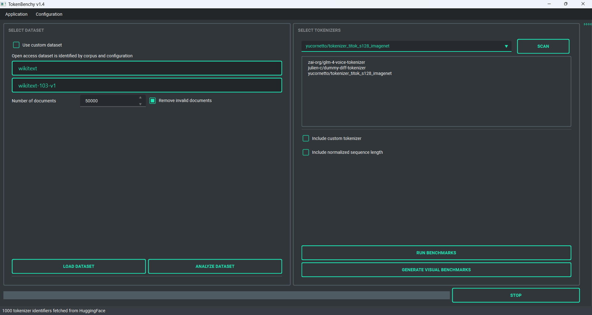

# TokenBenchy: Exploring and Benchmarking Open Source Tokenizers

## 1. Project Overview
Tokenizers are essential components in text preprocessing, converting raw text into structured data understandable by NLP models. The choice of tokenizer directly influences model performance, making it a critical decision in building effective language-based applications. However, selecting an appropriate tokenizer can be challenging due to the diverse array of options available, each with distinct approaches and strengths.

TokenBenchy is a comprehensive toolkit designed to simplify tokenizer analysis and comparison. This fully Python-based UI application allows users to effortlessly download HuggingFace's open-source tokenizers and publicly available text datasets to conduct detailed benchmarks. TokenBenchy enables exploration and comparison of tokenizer attributes including tokenization speed, granularity, handling of special characters, language support, and adaptability to domain-specific vocabularies. 
With TokenBenchy, users can effectively evaluate tokenizer performance in various NLP tasks such as text classification, sentiment analysis, language translation, and semantic search, ensuring informed decisions and optimized model performance.

## 2. Installation 
The installation process for Windows is fully automated. Simply run the script *start_on_windows.bat* to begin. During its initial execution, the script installs portable Python, necessary dependencies, minimizing user interaction and ensuring all components are ready for local use.  

**Important:** After installation, if the project folder is moved or its path is changed, the application will no longer function correctly. To fix this, you can either:

- Open *setup_and_maintenance.bat* and select *Enable root path imports* 
- Manually run the following commands in the terminal, ensuring the project folder is set as the current working directory (CWD):

    `conda activate TOKEXP`

    `pip install -e . --use-pep517` 

## 3. How to use
On Windows, run *start_on_windows.bat* to launch the application. Please note that some antivirus software, such as Avast, may flag or quarantine python.exe when called by the .bat file. If you encounter unusual behavior, consider adding an exception in your antivirus settings.

The intuitive main interface facilitates easy selection of text datasets and tokenizers, allowing users to run benchmarks across multiple tokenizers simultaneously. Benchmark results are conveniently stored in the application's database. For each tokenizer, benchmarking metrics are calculated using both the extracted vocabulary and HuggingFace's decoder methods, highlighting any discrepancies between these approaches. The following statistics are analyzed for each selected tokenizer:

- **text characters**: The number of characters in the original text.
- **words count**: The number of words in the text.
- **AVG words length**: The average character length of words in the text.
- **tokens count**: The total number of tokens generated by the tokenizer.
- **tokens characters**: The total number of characters in the tokenized output.
- **AVG tokens length**: The average character length of tokens.
- **tokens to words ratio**: The ratio of token count to word count.
- **bytes per token**: The number of bytes per token, derived from the original text length. 

**Setup and Maintenance:** you can run *setup_and_maintenance.bat* to start the external tools for maintenance with the following options:

- **Run installation:** run the application installer for Windows
- **Enable root path imports:** refresh root path imports if the main folder has been moved or renamed
- **Update project:** check for updates from Github
- **Remove logs:** remove all logs file from *resources/logs*

### 3.1 Resources
This folder organizes dataset and tokenizers benchmark results. By default, all data is stored within an SQLite database. To visualize and interact with the SQLite database, we recommend downloading and installing the DB Browser for SQLite, available at: https://sqlitebrowser.org/dl/. The directory structure includes the following folders:

- **database:** tokenizers benchmark results will be stored centrally within the main database *TokenBenchy_database.db*. Graphical evaluation outputs for the performed benchmarks will be saved separately in *database/evaluation*. Moreover, this folder contains the downloaded datasets that are used to test the tokenizers performance (open access datasets are saved in *datasets/open* while the custom dataset is saved into *datasets/custom*). Last but not least, the downloaded tokenizers are saved in *database/tokenizers* following the same organisation of the datasets folder. 

- **logs:** log files are saved here

- **templates:** reference template files can be found here

**Environmental variables** are stored in the *app* folder (within the project folder). For security reasons, this file is typically not uploaded to GitHub. Instead, you must create this file manually by copying the template from *resources/templates/.env* and placing it in the *app* directory.

| Variable              | Description                                              |
|-----------------------|----------------------------------------------------------|
| ACCESS_TOKEN          | HuggingFace access token (required for some tokenizers)  |
| TF_CPP_MIN_LOG_LEVEL  | TensorFlow logging verbosity                             |
| MPLBACKEND            | Matplotlib backend, keep default as Agg                  |

## 4. License
This project is licensed under the terms of the MIT license. See the LICENSE file for details.

