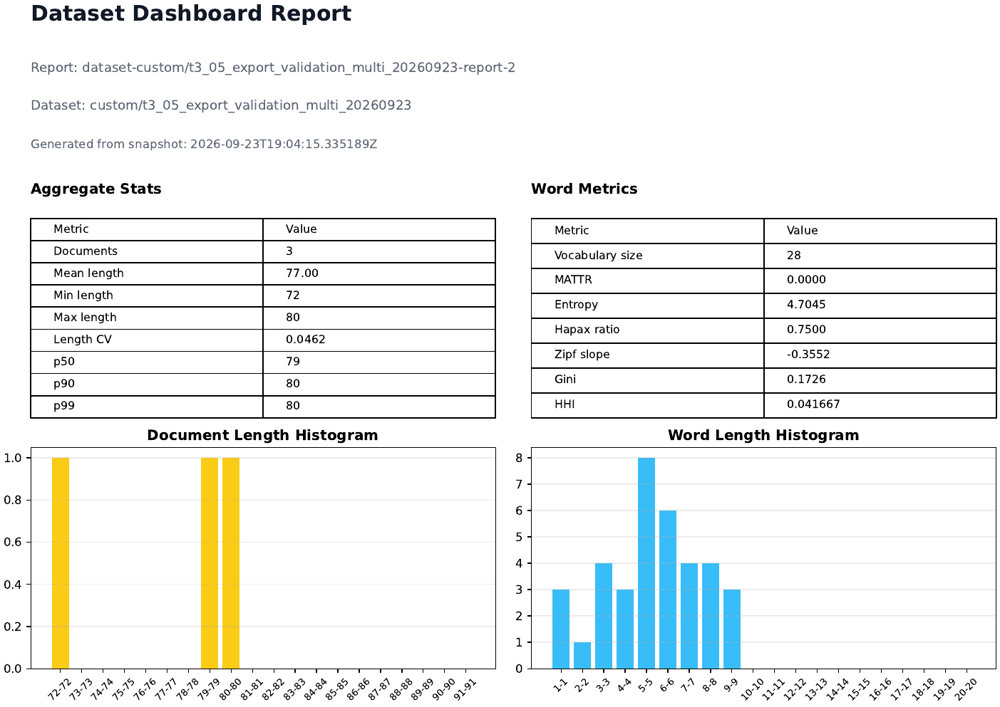
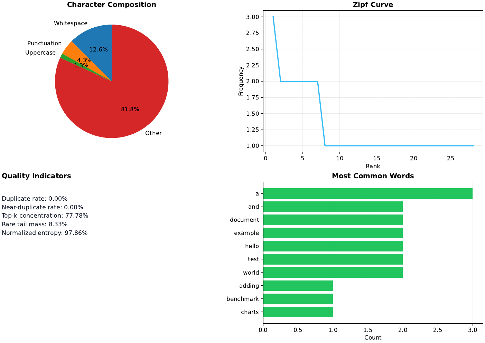
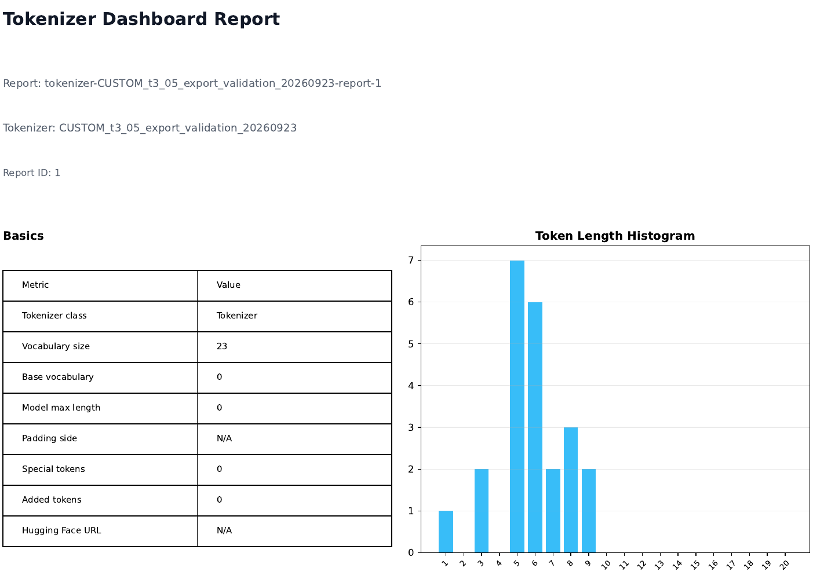
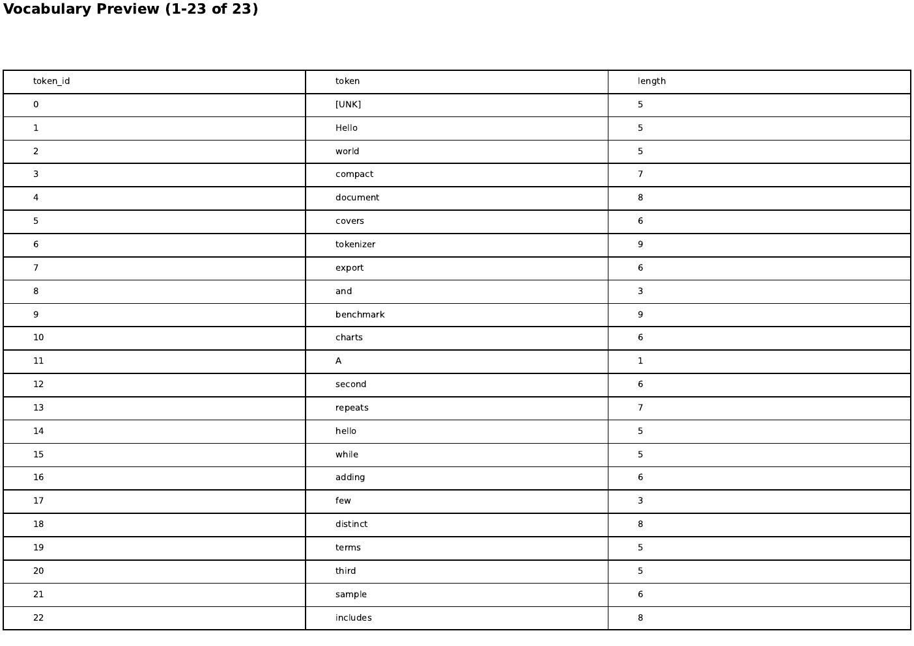
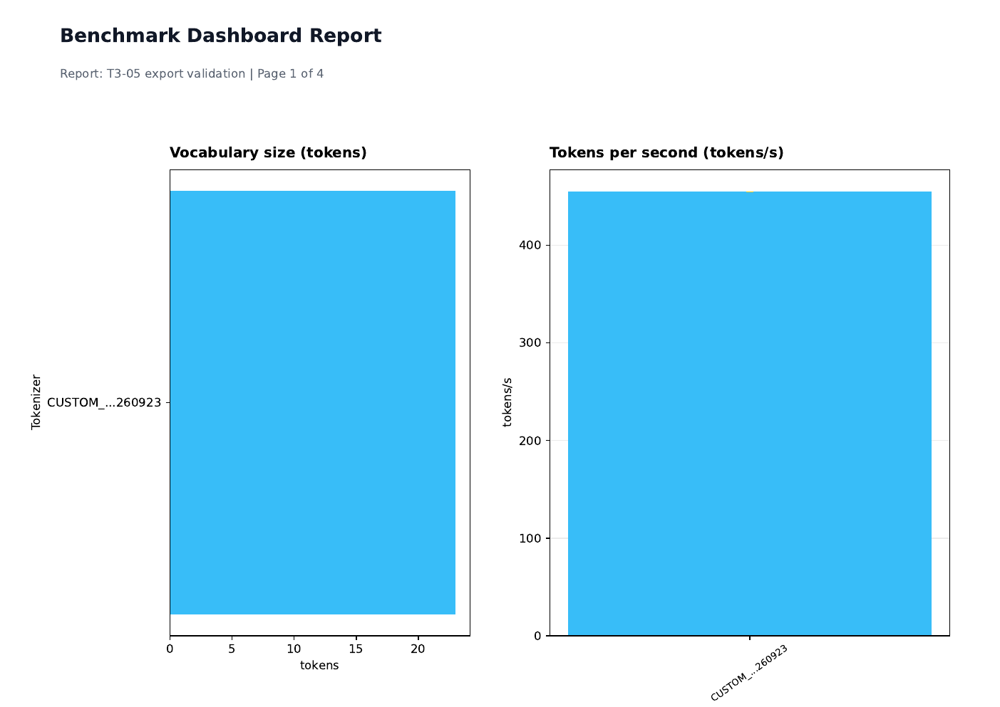
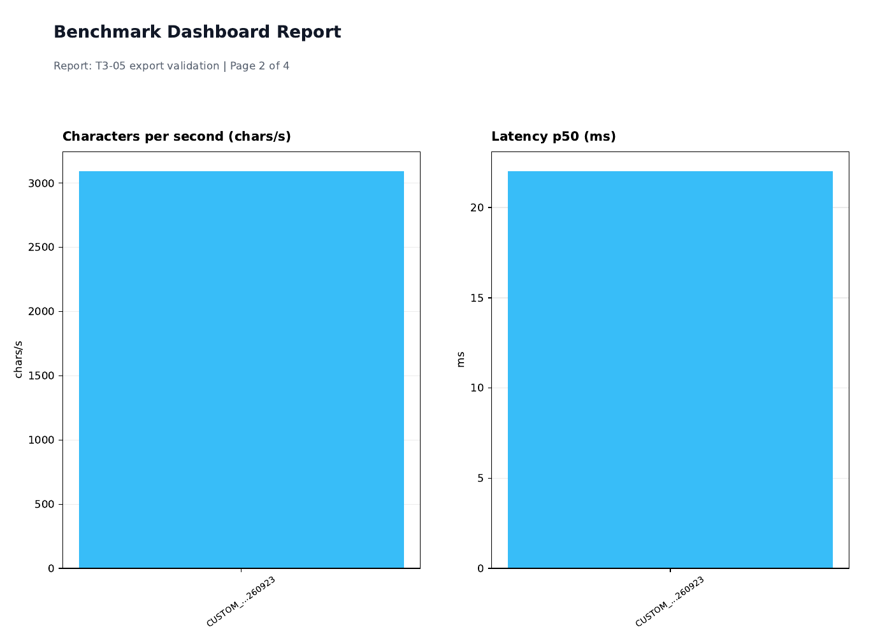
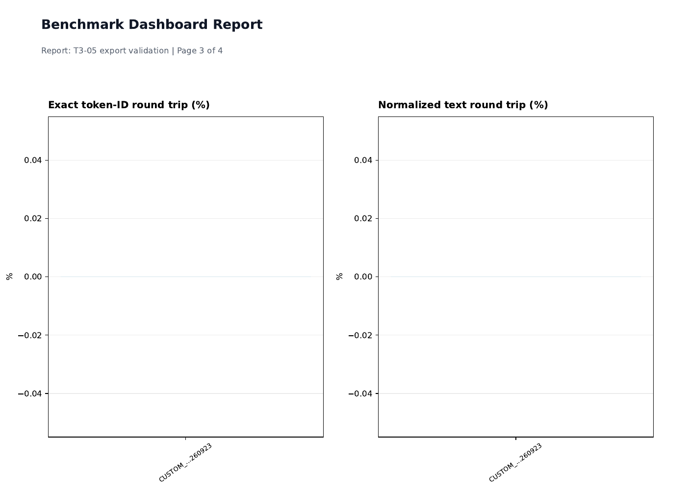
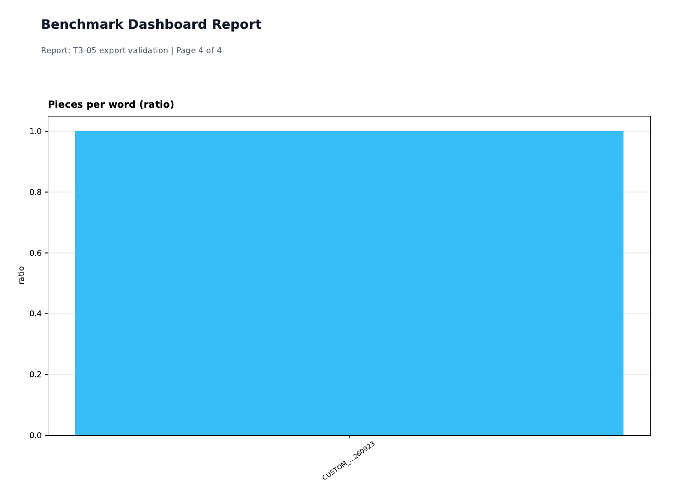

# T3-05 Dashboard PDF Export Validation

Date: 2026-09-23
Result: PASS
Branch: `develop`, started from `cf9b320` with the validated changes included in this commit

## Scope and environment

Validated the current dataset, tokenizer, and benchmark dashboard export paths using the official Windows launcher and isolated local reports. The temporary `settings/.env` overrides pointed `TKBEN_DATA_DIR` to `assets/QA/tkben-t3-05-export-isolated-20260923/app-data` and logs to the adjacent isolated `logs` directory. The original `settings/.env` bytes were restored and its SHA-256 matched `A60AD93B87A38594A1D7AFD00D968C3F98BA591A703AB92F86461B150310867E`.

The live reports were synthetic and isolated:

- Dataset report 2, `custom/t3_05_export_validation_multi_20260923`: 3 documents, 77 selected metric keys, mean document length 77, vocabulary size 28.
- Tokenizer report 1, `CUSTOM_t3_05_export_validation_20260923`: 23 vocabulary entries.
- Benchmark report 1, `T3-05 export validation`: 1 document and 1 tokenizer. The populated dashboard showed seven widgets. The Vocabulary size widget used the persisted `horizontal_bar` visualization and its expanded data table showed 23 tokens.

The in-app browser opened each saved report and invoked its PDF export control. After the final renderer change, the live export endpoint was also called with the same populated report data and selected benchmark dashboard preferences:

| Dashboard | Download filename | HTTP / content type | Pages | Bytes |
| --- | --- | --- | ---: | ---: |
| Dataset | `dataset-custom-t3_05_export_validation_multi_20260923-report.pdf` | 200 / `application/pdf` | 2 | 38,596 |
| Tokenizer | `tokenizer-CUSTOM_t3_05_export_validation_20260923-report-1.pdf` | 200 / `application/pdf` | 2 | 35,919 |
| Benchmark | `benchmark-report-1.pdf` | 200 / `application/pdf` | 4 | 34,369 |

Each response had the matching `Content-Disposition` filename, `X-Export-Page-Count` of 2/2/4, and `%PDF-` signature. `pdfinfo` reported the same page counts and A4 page sizes. PDF text extraction confirmed the report titles and identifying values.

## Rendered review and fixes

All eight pages were rendered at 120 dpi and inspected. The dataset pages show the three-document aggregates and distribution charts. The tokenizer pages show the saved report and all 23 vocabulary rows. The benchmark pages show the seven visible metric widgets, including the saved horizontal-bar override and tokenizer/value relationship shown by the live table.

The initial benchmark render clipped the start of the long tokenizer name and placed the horizontal chart's axis title incorrectly. The renderer now shortens long names while preserving both ends, reserves a wider left gutter for charts with category labels, and labels axes according to visualization orientation and metric units. The final page shows `CUSTOM_...260923`, `tokens`, and `Tokenizer` fully within the page.

The Dataset dashboard also had one older incomplete behavior called out in the ledger: malformed optional histogram payloads. `toHistogramSeries` now validates the runtime envelope, drops invalid or negative counts, converts numeric-string counts, and falls back to stable index labels when bins are missing or malformed. The updated frontend unit test covers invalid envelopes and mixed valid/invalid counts.

## Verification

- Backend export contract, service, and route tests: 17 passed. Pytest emitted one existing warning for the unknown `cache_dir` configuration option.
- Frontend dataset dashboard normalization tests: 6 passed.
- Frontend lint and production build: passed.
- Ruff on the changed Python service and contract-test files: passed.
- `git diff --check`: passed.

The isolated database, temporary PDFs, and test cache were removed after review. The launcher-owned processes were stopped, ports 5000 and 8000 were confirmed clear, and the original environment file remained byte-for-byte restored.

## Remaining limits and independent gates

T3-05 is PASS. The broader `benchmark.dashboard-and-pdf-export` component remains WORKING because manual PDF inspection covered the seven currently visible widgets and one non-default visualization; other visualization overrides and vocabulary exports beyond 23 entries were not visually reviewed. Existing unit coverage exercises the canonical renderer variants. The malformed dataset histogram fallback was verified at its normalization boundary; the live backend emits well-formed reports.

These incomplete gates are independent of the local PDF export slice and remain as recorded in the ledger:

| Gate | Status | Remaining work |
| --- | --- | --- |
| T3-02 / `benchmark.execution-and-reporting` | PARTIAL | Parallelism is accepted and saved but tokenizer execution remains serial; define and implement or remove the setting. |
| T4-01, T4-03 | BLOCKED | Approved Hugging Face network/provider validation and gated credential access are required. |
| T4-02 | UNTESTED | Public dataset download, network behavior, disk handling, and cleanup need validation. |
| T4-04 | BLOCKED | A disposable PostgreSQL target and credentials are required. |
| T5-02 | UNTESTED | Dataset and Settings responsive/keyboard coverage is outstanding. |
| T5-03 | PARTIAL | Tokenizers responsive and keyboard coverage remains after the populated Cross Benchmark flows. |
| T5-05 | PARTIAL | macOS and hosted `ubuntu-latest` remain untested. |
| T5-06 | PARTIAL | Release publication evidence remains separate from the passing hosted CI run. |
