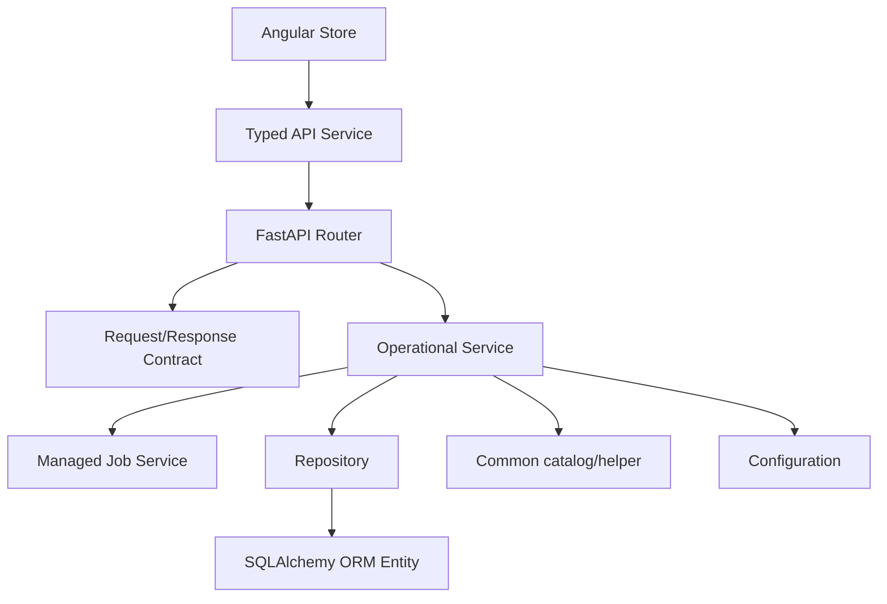
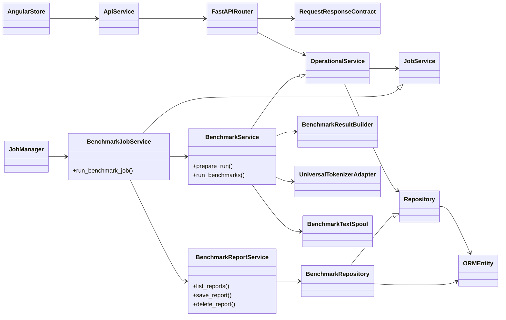

# Architecture Review
Last updated: 2026-08-20

## Current State

TKBEN is a local Angular and FastAPI application with synchronous SQLAlchemy
repositories, a managed background-job system, and optional Hugging Face and
PostgreSQL integrations. The application now has explicit ownership layers:

`api -> contracts/configurations/services -> repositories/common -> database schemas`

The frontend keeps API models in `app/client/angular/app/core/api/api.models.ts`
and exposes them through typed clients and signal stores. The backend keeps
request/response contracts under `server/contracts`, runtime configuration under
`server/configurations`, operational behavior under `server/services`, and
persistence under `server/repositories`.

The benchmark path is intentionally concrete: `BenchmarkService` admits and
orchestrates a run, `BenchmarkJobService` owns the managed execution lifecycle,
`BenchmarkResultBuilder` constructs the report payload,
`BenchmarkReportService` coordinates report persistence, and the benchmark
repository/database layer commits the result. The persistence schema is owned
by Alembic and was not changed by this module-ownership remediation.

## Architectural Strengths

- API routers are thin and return explicit contract models and HTTP errors.
- Contract modules are free of API, service, repository, FastAPI, and
  SQLAlchemy implementation imports.
- Repositories provide clear persistence boundaries for datasets, tokenizer
  reports, and benchmark reports.
- Long-running work has one managed-job lifecycle for start, poll, and
  cooperative cancellation.
- Benchmark admission is centralized in `BenchmarkService.prepare_run()` and
  execution retains a defensive ready-dataset check.
- Benchmark reports use immutable schema-3/report-5 snapshots while list
  queries use projected summary columns.
- The frontend models preserve backend nullability for unavailable metrics and
  keep required per-document observation arrays explicit.
- Alembic remains the single schema authority, with startup migration locking,
  integrity checks, and safe handling of recognized unversioned databases.
- AST tests and CI now make the most important import and compile contracts
  executable.

## Findings

### P1 — Ambiguous backend ownership

The former `server.domain` package mixed contracts, settings, bootstrap state,
and benchmark observations. Serialization also lived in a generic namespace,
and `BenchmarkService` owned report storage incidentally. This made dependency
direction difficult to inspect and encouraged feature code to depend on broad
facades.

Status: remediated. Contracts, configuration, observations, repositories, and
benchmark report orchestration now have explicit homes. The old namespaces and
production import paths were removed rather than retained as forwarding aliases.

### P2 — Benchmark admission mixed with route and execution concerns

The benchmark route had to know more about validation and custom-tokenizer
resolution than an HTTP adapter should. The execution path also had to defend
its dataset precondition separately.

Status: remediated. `BenchmarkService.prepare_run()` is the admission boundary;
the route delegates through a worker thread, and the execution boundary keeps
the defensive count check.

### P3 — Redundant frontend API type alias

`api.types.ts` duplicated the canonical API model module without adding an
independent contract boundary.

Status: remediated. Consumers import `api.models.ts` directly, and a nullable
report fixture test protects the backend/frontend contract shape.

### Scope decisions

No P0 runtime or data-integrity issue was found. The remediation deliberately
does not introduce dependency injection frameworks, a queue or microservice
split, a new persistence schema, a benchmark-report/tokenizer junction table,
or a second frontend state abstraction. A larger mixin decomposition and a
separate cross-benchmark orchestration object were assessed as future
refactors, not prerequisites for the ownership fix; the current benchmark
service and tests provide a smaller, behavior-preserving boundary.

## Target State

Feature changes should follow this ownership graph:

The backend must remain inward-directed: API adapters depend on contracts and
services; services depend on contracts, configuration, common helpers, and
repositories; repositories depend on database adapters, schemas, configuration,
and common helpers. Contracts must remain implementation-free.

The implementation-level benchmark relationships are:

## Remediation

Completed implementation work:

1. Replaced the mixed domain package with `contracts`,
   `configurations`, and service-owned benchmark observations.
2. Moved dataset and tokenizer report persistence into named repositories and
   moved benchmark report orchestration into `BenchmarkReportService`.
3. Centralized benchmark admission in `BenchmarkService.prepare_run()` and
   kept execution precondition checks defensive.
4. Added AST-enforced import boundaries and moved dependency-free metric
   catalogs into `server/common` so repositories do not depend on services.
5. Made nullable benchmark metric fields and required per-document arrays
   explicit in the Angular API models, with a representative contract fixture.
6. Removed the redundant frontend API type alias.
7. Added the architecture boundary test and frontend unit-test gate to CI.
8. Updated the architecture, persistence, API, coding, testing, index, and
   README documentation to describe the implemented state and the migration
   workflow.

The remediation is module ownership only. There is no Alembic revision,
database migration, data rewrite, generated frontend artifact, or compatibility
alias to clean up.

## Architecture Risks

- The managed job registry remains in-process, so process restart loses active
  job state; this is acceptable for the local-app scope but is a deployment
  constraint.
- Synchronous SQLAlchemy repositories require continued worker-thread use from
  async endpoints; the architecture test cannot prove runtime scheduling.
- Hugging Face availability, configured credentials, and PostgreSQL concurrency
  remain environment-dependent runtime gates rather than static guarantees.
- The benchmark execution mixin is still a larger orchestration unit than the
  persistence boundary. Future decomposition should be driven by a concrete
  behavior or testability need and preserve the current report contract.
- Angular compile-time nullability does not prove every provider/runtime metric
  is populated; the UI must continue to render unavailable values as empty
  states rather than synthetic zeroes.

The validation record for this review is kept under
`assets/QA/architecture-remediation-20260820` and the executable import
contract is `tests/unit/server/test_architecture_boundaries.py`.
