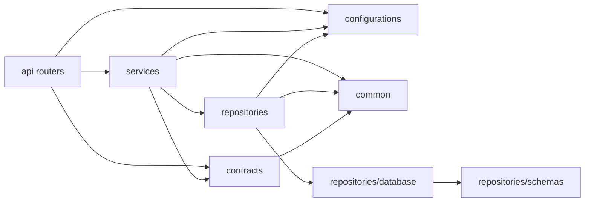
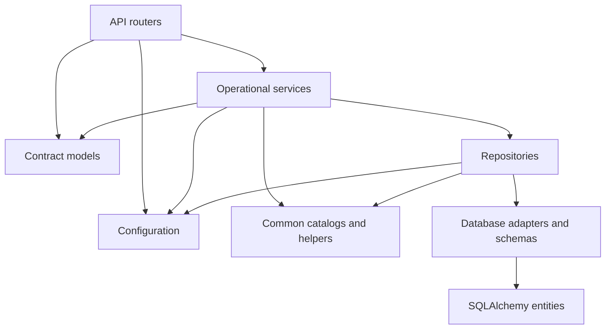
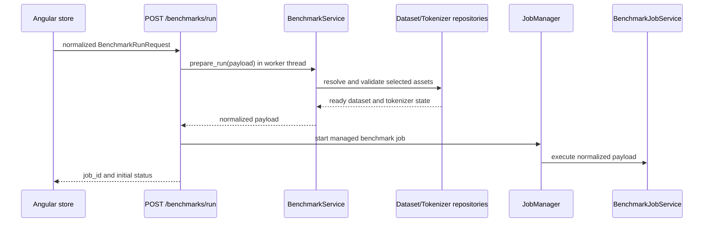
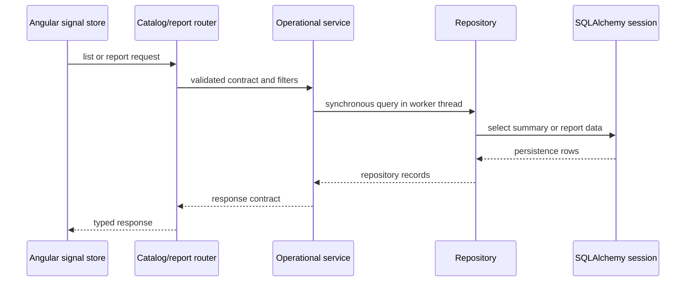
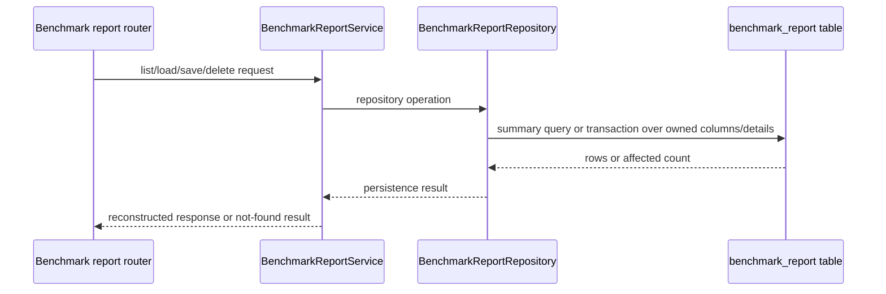
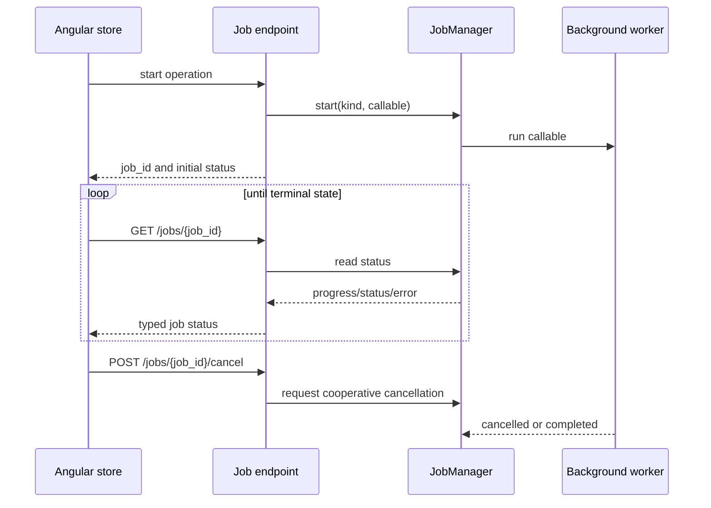
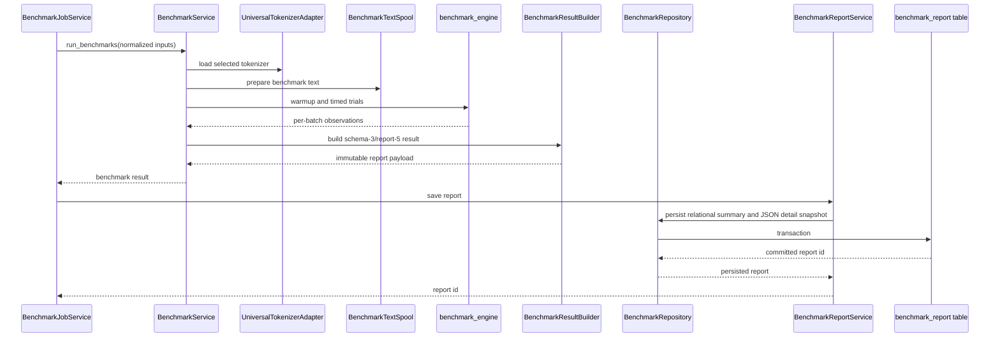

# Execution and Data Flow
Last updated: 2026-08-29

## Layered Architecture

The backend uses a one-way ownership flow:

`API router -> contract model -> operational service -> repository -> database/filesystem/provider`

API routers translate HTTP concerns and delegate work. Contract models define
the request and response boundary. Services own business rules and
orchestration. Repositories own persistence and query details. Configuration,
common catalogs, and managed-job infrastructure are shared inward-facing
dependencies rather than a second domain layer.

## Key Module Responsibilities

- `server/api/*`
  - HTTP routing, dependency construction, status codes, multipart handling,
    and HTTP error mapping. Routers do not contain persistence logic.
- `server/contracts/*`
  - Pydantic request, response, settings, and report contracts shared at the
    API and service boundary. These modules do not import API, service, or
    repository implementations.
- `server/configurations/*`
  - Environment loading, structured settings, startup configuration, and
    database configuration. One process-level `ServerSettings` snapshot is
    resolved for application startup; structured JSON contains content
    catalogs/jobs only and cannot override database settings.
- `server/services/*`
  - Operational business logic, validation, orchestration, and report
    workflows. `services/benchmark_reports.py` owns benchmark report
    persistence orchestration.
- `server/repositories/*`
  - Dataset, tokenizer-report, benchmark-report, database, query, and schema
    persistence boundaries. Repositories do not call API or service modules.
- `server/common/*`
  - Shared metric catalogs, benchmark metric definitions, logging, and small
    cross-cutting helpers with no feature-service ownership.
- `app/client/angular/app/core/api/*`
  - Typed HTTP clients and the canonical API models used by signal stores.
- `app/client/angular/app/core/state/*`
  - Signal-based catalog, report, persistence, and modal state. Page components
    consume state and rendering helpers rather than reconstructing API rules.

The current import boundary is checked by
`tests/unit/server/test_architecture_boundaries.py`.

## Configuration and schema flow

`create_app()` resolves the process-level settings snapshot once and places it
on application state. Lifespan startup, database initialization, repositories,
and services consume that snapshot rather than independently reloading
configuration. `.env` owns operational values; `configurations.json` owns
datasets, tokenizers, benchmarks, and jobs. PostgreSQL uses the fixed
`postgresql+psycopg` driver when external mode is selected.

Alembic is the only schema authority. Empty databases upgrade through the
tracked graph, while non-empty databases without an Alembic version row,
unknown revisions, multiple heads, or ahead-of-application revisions fail
explicitly. Revision `0003_canonical_state_cleanup` removes incompatible
report rows and normalizes direct metric keys and persisted tokenizer sources.

## Dependency Maps

The implemented backend dependency direction is:

The target architecture for feature work is the same direction, with shared
contracts and common catalogs kept below the feature services:

Forbidden directions include API modules importing repositories directly,
contracts importing services or persistence, repositories importing services,
and services importing API modules. The removed `server.domain` and
`server.repositories.serialization` paths are not compatibility namespaces;
new code must use the ownership paths above.

## Benchmark Admission and Execution

`POST /api/benchmarks/run` is a thin orchestration endpoint. It validates the
HTTP contract, calls `BenchmarkService.prepare_run()` in a worker thread, maps
known admission failures to HTTP 400, and starts the managed benchmark job.
Preparation performs the rules that need the configured repositories: it
rejects an empty tokenizer or dataset selection, checks persisted tokenizer
identity, source, and canonical artifact availability, checks that the selected
dataset has ready documents, and returns a normalized payload. The
execution mixin retains a defensive ready-document count check at the actual
run boundary.

This keeps admission failures synchronous and deterministic while ensuring
benchmark execution remains off the async request handler.

## Catalog and Report Flows

Catalog reads use synchronous repository calls inside worker-thread service
operations when invoked from async endpoints. The service applies business
filters and returns contract-shaped data; the router owns only HTTP response
construction.

Benchmark report list, load, save, and delete operations belong to
`BenchmarkReportService`, using `BenchmarkReportRepository` for persistence.
`BenchmarkService` prepares and executes benchmarks but does not own report
storage. Tokenizer report storage belongs to
`TokenizerReportRepository`; dataset materialization belongs to
`DatasetRepository`.

## Managed Jobs

Long-running download, analysis, benchmark, and export operations run through
`JobManager`. Endpoints return after job creation; polling reads in-memory
status, and cancellation sets a cooperative cancellation event consumed by the
runner. Initialization failures and conflicts are translated by the managed
job HTTP adapter rather than leaking worker exceptions.

## Benchmark Persistence Flow

The benchmark engine produces observations; result construction and report
materialization are separate from report persistence. The job service owns the
managed execution lifecycle, `BenchmarkService` owns benchmark orchestration,
and `BenchmarkReportService` owns the final report transaction.

## Async and Sync Constraints

- FastAPI endpoints are mostly `async def` orchestrators.
- Blocking repository calls, provider access, and CPU-heavy preparation are
  offloaded with `asyncio.to_thread(...)` or run inside `JobManager` workers.
- Job polling and cancellation are short synchronous reads/writes over
  in-memory managed-job state.
- Repository and database operations use synchronous SQLAlchemy sessions.
- Hugging Face discovery failures propagate through the service and become a
  sanitized HTTP 500; an outage is not represented as a successful empty
  catalog.
- The Angular stores debounce filters and use request sequencing or
  `switchMap` so stale catalog/report responses cannot replace newer state.

Async handlers must not execute CPU-heavy work or blocking I/O inline.
