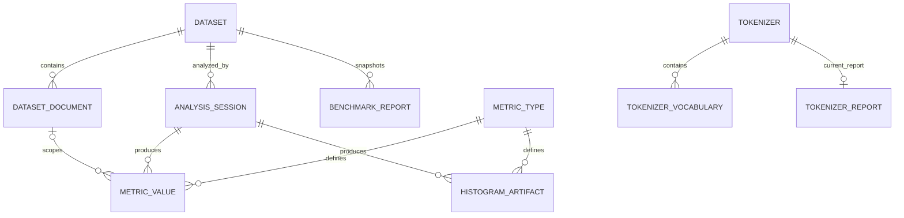

# Persistence
Last updated: 2026-08-20

## Storage selection

Embedded SQLite is the default local store at `app/resources/database.db`. Set
`TKBEN_DATA_DIR` to override the resource root; the embedded database then uses
`<TKBEN_DATA_DIR>/database.db`. The PostgreSQL backend is selected with
`DATABASE_EMBEDDED=false` and `postgresql+psycopg` settings. Database access is
injected through the repository backend.

Alembic is the authoritative schema owner. Application startup and the
database-initialization command run the same idempotent migration workflow:
they create a missing SQLite file (or a missing PostgreSQL target when the
configured role has `CREATEDB`), acquire the backend migration lock, adopt a
supported unversioned schema when safe, upgrade to the single repository head,
verify that head, and seed the metric catalog in the protected transaction.
`Base.metadata.create_all()` is not used for production initialization.

SQLite migrations use `BEGIN IMMEDIATE`, bounded by
`DATABASE_CONNECT_TIMEOUT`, and run a foreign-key integrity check before
commit. PostgreSQL uses an advisory transaction lock; database creation is
serialized through a separate maintenance-database advisory lock. A failed
migration or seed rolls back and prevents FastAPI from becoming ready.
Databases ahead of the application, unknown revisions, multiple heads, and
unrecognized or partial unversioned schemas fail without automatic downgrades
or destructive changes.

An unversioned database is adopted only when its tables, columns, keys,
relationships, indexes, and recognized historical differences match a
supported TKBEN signature. The pre-Alembic signature is stamped at
`0001_pre_alembic_schema` and upgraded; the current signature is stamped at
`0002_current_schema`.

## Canonical tables

The schema contains `dataset`, `dataset_document`, `analysis_session`,
`metric_type`, `metric_value`, `histogram_artifact`, `tokenizer`,
`tokenizer_vocabulary`, `tokenizer_report`, `benchmark_report`, and
`hf_access_keys`. The obsolete `dataset_validation_report` table is removed.

The canonical ownership and cardinalities are:



`HF_ACCESS_KEYS` is intentionally standalone: it stores encrypted provider
credentials and activation state and has no foreign-key relationship to the
feature tables. `METRIC_VALUE.dataset_id` participates in composite foreign
keys with `(session_id, dataset_id) -> ANALYSIS_SESSION` and
`(document_id, dataset_id) -> DATASET_DOCUMENT`; `document_id` is nullable for
aggregate values. The diagram shows the logical relationships without
duplicating every composite key column.

Datasets are imported as `loading` records and become visible only after all
documents are inserted and the row is finalized as `ready`. Documents have a
dataset-local ordinal and the ready document count is stored on `dataset`.
Failed or cancelled loading imports are deleted and database cascades remove
their documents.

Metric values carry the owning dataset, enforce composite session/document
ownership, require exactly one value representation, and use partial unique
indexes for aggregate and per-document values. Tokenizer reports are
current-only: replacing a report replaces its vocabulary and report as one
logical operation. Benchmark reports keep immutable schema-3/report-5 JSON
snapshots plus projected summary columns; list queries do not select the full
payload. Reports from older contracts are filtered out and never migrated;
dashboard histogram bins remain inside the immutable payload snapshot.

Benchmark report snapshots store tokenizer names in JSON because the report is
an immutable run record; there is no benchmark-report/tokenizer junction table.
The `tokenizer_report` uniqueness rule makes the persisted tokenizer report
current-only, while `benchmark_report` preserves historical run snapshots.

Report deletion removes the `benchmark_report` row physically in one repository
transaction. There is no soft-delete record or compatibility tombstone;
subsequent list and load queries no longer return the deleted report, including
after restart.

## Persistence ownership

Persistence ownership follows the repository/service split:

- `repositories/datasets.py` owns dataset and analysis materialization and is
  represented by `DatasetRepository`.
- `repositories/tokenizer_reports.py` owns tokenizer report and vocabulary
  persistence and is represented by `TokenizerReportRepository`.
- `services/benchmark_reports.py` owns benchmark report persistence
  orchestration through `BenchmarkReportService`.
- The report service uses the benchmark repository/database boundary for
  transactions and summary/payload queries.

This naming and ownership refactor does not change the schema, response
fields, ordering, or transaction behavior. The removed
`repositories/serialization` namespace is not retained as a compatibility
alias.

## Backend and transaction guarantees

SQLite enables foreign keys at connection time. SQLite and PostgreSQL share the
same repository transaction behavior: bounded inserts and upserts commit once
per logical operation and roll back the whole operation on error. Hugging Face
key activation is atomic and the database permits at most one active key.
SQLite serializes writes; PostgreSQL is required for concurrent writer
validation.

Timestamps are normalized to aware UTC values at the persistence boundary.
JSON object and array fields are validated by typed SQLAlchemy decorators;
contract validation remains responsible for nested JSON contracts and
histogram array compatibility.

## Validation

The SQLite persistence contract covers schema creation, foreign keys, lifecycle
visibility, composite ownership, partial uniqueness, value-shape constraints,
cascades, rollback, active-key uniqueness, and keyset document streaming.
PostgreSQL integration validation must be run against a disposable database
before claiming PostgreSQL runtime equivalence.

## Migration workflow

From `app/server`, use the existing project environment with the TOML
configuration loaded explicitly:

```powershell
uv run python -c 'from alembic.config import Config; from alembic import command; command.current(Config(toml_file="pyproject.toml"), check_heads=True)'
uv run python -c 'from alembic.config import Config; from alembic import command; command.upgrade(Config(toml_file="pyproject.toml"), "head")'
uv run python -c 'from alembic.config import Config; from alembic import command; command.check(Config(toml_file="pyproject.toml"))'
uv run python -c 'from alembic.config import Config; from alembic import command; command.revision(Config(toml_file="pyproject.toml"), message="<change>", autogenerate=True)'
```

Review every generated revision manually; the tracked
`migrations/script.py.mako` file is the single revision-generation template,
not application runtime configuration. Alembic uses the pyproject
configuration and the application settings loader; no `alembic.ini` is
maintained, so database credentials have one source of truth in `settings/.env`.
Use the application initializer (launcher option 4 or
`app/scripts/initialize_database.py`) for an existing unversioned database so
the supported-schema adoption check runs before a direct Alembic upgrade.

The architecture remediation described by this document is module ownership
only. It requires no Alembic revision and no database migration.
