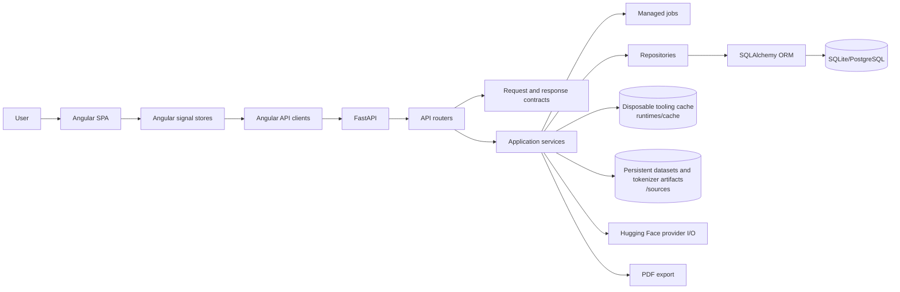

# System Overview
Last updated: 2026-09-20

## System Summary
TKBEN is a tokenizer benchmarking platform with:
- FastAPI backend (`app/server`)
- Angular 22 frontend (`app/client`)
- Shared local resources and settings (`app/resources`, `settings`)
- Alembic-owned persistence with direct metric keys, persisted tokenizer
  sources, and relational benchmark-report summaries and tags

The current public release is `v4.4.0` with backend `3.4.0` and frontend
`2.4.0`. It remains a source-only folder distribution launched with
`start_on_windows.ps1` on Windows.

Backend APIs are mounted under `/api/*`. Frontend calls `/api` and relies on the Angular proxy in dev and preview modes.

## Repository Structure
Source-level structure, with generated and environment-specific folders omitted:

```text
.
├─ assets/
│  ├─ docs/
│  └─ figures/
├─ start_on_windows.ps1
├─ settings/
│  ├─ .env
│  └─ .env.example
├─ app/
│  ├─ client/
│  │  ├─ package.json
│  │  ├─ angular.json
│  │  ├─ public/
│  │  │  └─ tkben-logo.png
│  │  ├─ angular/
│  │  │  ├─ app/
│  │  │  └─ styles.css
│  ├─ server/
│  │  ├─ pyproject.toml
│  │  ├─ app.py
│  │  ├─ api/
│  │  ├─ contracts/
│  │  ├─ configurations/
│  │  ├─ common/
│  │  ├─ services/
│  │  │  └─ benchmark_reports.py
│  │  ├─ repositories/
│  │  │  ├─ datasets.py
│  │  │  ├─ tokenizer_reports.py
│  │  │  ├─ database/
│  │  │  ├─ queries/
│  │  │  └─ schemas/
│  │  └─ migrations/
│  │     └─ versions/0004_benchmark_report_tags.py
│  ├─ scripts/
│  ├─ tests/
│  └─ resources/
└─ LICENSE
```

## Application Entry Points
- Backend app factory/module:
  - `server.app:create_app` constructs the FastAPI app and registers API and frontend routes.
  - `server.app:app` is the canonical ASGI entry point.
- Frontend entry:
  - `app/client/angular/main.ts`
- Frontend routing root:
  - `app/client/angular/app/app.routes.ts`
- Frontend shell:
  - `app/client/angular/app/components/app-shell.component.ts` provides the branded header, primary route tabs, and Settings route action. Hugging Face key management is owned by the canonical Settings → Keys section and reuses the existing `/api/keys` service.
- Frontend data and interaction helpers:
  - Signal stores under `app/client/angular/app/core/state/` own catalog loading,
    report state, polling, and in-memory UI state; only `BenchmarkStore` owns
    persisted dashboard preferences and report-scoped baseline preferences.
  - Pure normalization helpers under `app/client/angular/app/core/utils/` own dataset and chart payload shaping.
- Windows launcher:
  - `start_on_windows.ps1` is the single user-facing root entry point for the combined launch and maintenance menu.

Startup resolves one immutable settings snapshot. `settings/.env` is loaded
before configuration and database imports and owns environment-specific values.
Typed Pydantic models own application runtime defaults, and the optional
`<TKBEN_DATA_DIR>/runtime-settings.json` stores only validated sparse user
overrides. `GET/PATCH /api/settings` is the supported editing surface; runtime
file corruption falls back to typed defaults with a warning and does not block
startup. No startup, infrastructure, path, security, or secret value is part
of the Settings API or page.

## Reporting Service Boundaries
- `server.services.TokenizersService` owns Hugging Face discovery, catalog,
  download, and custom-tokenizer workflows. Custom tokenizer identity is
  stored in the database and its canonical artifact is stored as persistent
  application data under `<TKBEN_DATA_DIR>/sources/tokenizers`; downloaded
  datasets use the corresponding persistent `sources/datasets` location.
- Disposable tooling and runtime caches are owned by the repository-wide
  `runtimes/cache` root and are not the storage location for datasets or
  tokenizer artifacts.
- `server.services.TokenizerReportingService` owns tokenizer metadata, vocabulary analysis, report generation, and report retrieval.
- `server.services.BenchmarkService` owns benchmark admission, execution, and runtime result construction.
- `server.services.BenchmarkReportService` owns benchmark report contract validation, persistence orchestration, and response normalization.
- `server.repositories.BenchmarkRepository` owns projected report tags and the
  dedicated tag update transaction; tags are relational metadata outside the
  immutable benchmark detail payload.
- `server.repositories.DatasetRepository` owns dataset, analysis-session, metric, and histogram persistence.
- `server.repositories.TokenizerReportRepository` owns tokenizer report and vocabulary persistence; `TokenizerRepository` owns tokenizer identity/catalog storage.
- `server.services.dataset_statistics` owns the focused `LengthStatistics` and `HistogramBuilder` components used by dataset analysis.
- `server.services.ManagedJobService`, exposed to API handlers through `ManagedJobHttpAdapter`, centralizes job conflict checks, start-up, and initial status validation.
- There are no legacy service aliases, registry-only tokenizer rows, or
  compatibility forwarding methods between these boundaries.

## High-Level Architecture

The application separates external provider and filesystem I/O from relational
persistence. Hugging Face and PDF export are service-side integrations; SQLite
or PostgreSQL is reached only through repositories and SQLAlchemy.



## Runtime Interaction Topology
- Local webapp mode:
  - Browser -> Angular preview (`UI_HOST:UI_PORT`) -> proxied `/api` -> FastAPI (`FASTAPI_HOST:FASTAPI_PORT`)
- The launcher uses the canonical backend environment at `app/server/.venv`,
  installs the locked frontend tree with `npm ci`, builds the frontend when
  dependencies or `dist/tkben-angular/browser/index.html` are missing or the
  source-fingerprint stamp is stale, starts both services on the configured
  defaults (`5000` and `8000`), verifies the configured ports, and opens the
  configured UI URL.
